# Business Central Integration Documentation

Last updated: 2026-05-27

Branch analyzed: `bc_int` tracking `origin/bc_int`

Source files analyzed:

- `supabase/functions/bc-claim/index.ts`
- `supabase/functions/bc-claim/payloadBuilder.ts`
- `supabase/functions/bc-claim/types.ts`
- `supabase/functions/bc-reference/index.ts`
- `supabase/functions/bc-vendor-search/index.ts`
- `supabase/functions/_shared/auth.ts`
- `supabase/functions/_shared/bcAuth.ts`
- `supabase/functions/_shared/bcClient.ts`
- `supabase/functions/_shared/bcEnv.ts`
- `supabase/functions/_shared/bcSearch.ts`
- `supabase/functions/_shared/cors.ts`
- `supabase/functions/_shared/logger.ts`
- `src/modules/claims/ui/bc-claim-modal.tsx`
- `src/modules/claims/ui/claim-decision-action-form.tsx`
- `src/core/constants/payment-modes.ts`
- `src/core/domain/claims/utils.ts`
- BC-related Supabase migrations under `supabase/migrations`

Input sheets analyzed:

- `BC.xlsx`
  - `V2`
  - `Sheet1`
  - `BC`
- `nxtclaim table creation(Sheet1).csv`

## Purpose

The Business Central integration lets a finance approver submit an eligible
NxtClaim expense claim into Microsoft Dynamics 365 Business Central during the
finance approval step.

In this branch, the normal finance approval path changes for expense payment
modes:

1. Finance opens a claim that is already HOD-approved.
2. Finance clicks approve.
3. If the claim payment mode is an expense mode, the app opens the Business
   Central modal instead of directly calling the old finance approval action.
4. Finance chooses whether this is a non-vendor or vendor payment.
5. For vendor payment, finance also selects vendor and reference codes from
   Business Central.
6. The app invokes the `bc-claim` Supabase Edge Function.
7. The edge function creates an in-flight local audit row.
8. The edge function posts a payload to Business Central.
9. On Business Central success, the database links the claim to the BC detail
   row and moves the claim to `Finance Approved - Payment under process`.
10. The later "mark paid" step remains an app workflow and closes the claim as
    `Payment Done - Closed`.

The integration is not a bulk spreadsheet upload in the current branch. The
workbook shows the historical/manual mapping model and sample transformed
Business Central journal rows. The CSV matches the newer custom Business
Central Claims API contract more closely.

## Current Implementation Shape

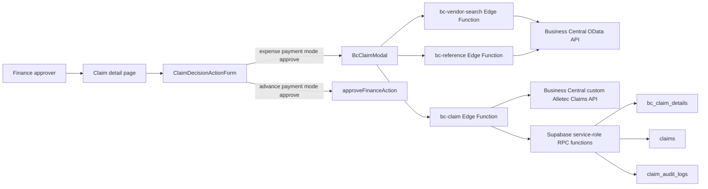

## Payment Mode Gate

The UI decides whether finance approval should open the Business Central modal
by checking whether the claim payment mode is an expense payment mode.

Code:

```text
src/modules/claims/ui/claim-decision-action-form.tsx
src/core/constants/payment-modes.ts
```

Expense payment modes:

```text
reimbursement
corporate card
happay
forex
petty cash
```

Advance payment modes:

```text
petty cash request
bulk petty cash request
```

Workflow:

1. Claim detail page renders finance authorization actions.
2. Finance approve button is wrapped by `ClaimDecisionActionForm`.
3. The component checks `isExpensePaymentModeName(paymentModeName)`.
4. If the decision is `approve`, the claim ID exists, and the payment mode is
   an expense mode, the BC modal opens.
5. If the payment mode is not an expense mode, the normal finance approval
   server action is called.

Important behavior:

- Business Central submission is currently tied to expense modes.
- The database payload function joins `expense_details`, so advance-only claims
  are not eligible for this BC submission path.
- After BC accepts the claim, the claim moves to finance-approved/payment-under-
  process without calling the old `approveFinanceAction`.

## Business Central Claim State Model

The app tracks Business Central submission attempts in `bc_claim_details`.

Important migration:

```text
supabase/migrations/20260517074417_bc_claim_details_schema.sql
```

Important current functions:

```text
supabase/migrations/20260520072138_bc_payload_status_gate_and_search_path.sql
```

`bc_claim_details` columns:

| Column              | Meaning                                   |
| ------------------- | ----------------------------------------- |
| `id`                | UUID primary key for the BC attempt row.  |
| `claim_id`          | NxtClaim claim ID.                        |
| `is_vendor_payment` | Finance modal selection for this attempt. |
| `bc_status`         | `submitting`, `success`, or `failed`.     |
| `bc_payload_json`   | Exact JSON payload sent to BC.            |
| `bc_response_json`  | BC response or failure body.              |
| `created_at`        | Attempt creation timestamp.               |
| `updated_at`        | Attempt update timestamp.                 |

`claims.bc_claim_details_id` is the canonical successful submission marker.

Code:

```text
src/core/domain/claims/utils.ts
```

```ts
(isBcSubmitted(claim) === claim.bcClaimDetailsId) !== null;
```

Meaning:

- `claims.bc_claim_details_id IS NULL` means the claim has no successful BC
  submission yet.
- A claim can still have failed BC attempts while this value is null.
- `claims.bc_claim_details_id IS NOT NULL` means BC accepted the claim and the
  linked `bc_claim_details` row is the successful attempt.

## BC Attempt State Machine

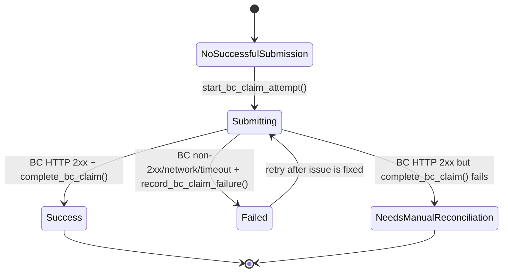

Status values:

```text
submitting
success
failed
```

Concurrency rule:

- A partial unique index allows at most one `submitting` or `success` BC attempt
  per claim.
- Failed rows do not block retry.
- A duplicate insert while another submission is in flight raises SQL
  `23505`, which the edge function returns as `ALREADY_IN_FLIGHT`.

## Claim Status Transition

Eligible starting status:

```text
HOD approved - Awaiting finance approval
```

Successful BC submission transition:

```text
HOD approved - Awaiting finance approval
  -> Finance Approved - Payment under process
```

Payment completion remains separate:

```text
Finance Approved - Payment under process
  -> Payment Done - Closed
```

The `get_bc_claim_payload` function now has a status gate. It rejects a claim
unless it is active and currently in `HOD approved - Awaiting finance approval`.

## Database Structure

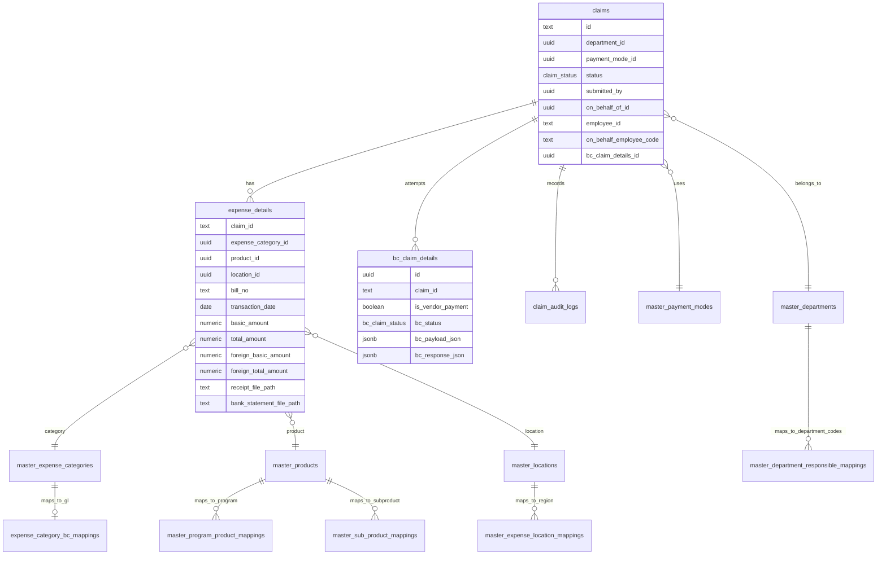

## Master Mapping Tables

Business Central payload construction depends on these mapping tables:

| Table                                    | Source concept            | BC value produced                            |
| ---------------------------------------- | ------------------------- | -------------------------------------------- |
| `expense_category_bc_mappings`           | NxtClaim expense category | GL/account code                              |
| `master_program_product_mappings`        | NxtClaim product          | Program code                                 |
| `master_sub_product_mappings`            | NxtClaim product          | Sub-product code                             |
| `master_expense_location_mappings`       | NxtClaim expense location | Region code                                  |
| `master_department_responsible_mappings` | NxtClaim department       | Responsible and beneficiary department codes |

If any required mapping is missing, `get_bc_claim_payload` returns SQLSTATE
`P0003`, and the edge function returns `MISSING_MAPPING`.

## Mapping Guard

Code:

```text
src/lib/dept-mapping-guard.ts
```

The guard checks active departments that do not have an active row in
`master_department_responsible_mappings`.

Why it matters:

- `get_bc_claim_payload` requires a department mapping.
- Missing mappings cause BC submission failure at finance approval time.
- This guard can be used by admin/settings tooling or tests to catch
  unmapped departments before finance users hit the modal failure.

## Edge Function Environment

Environment template:

```text
supabase/functions/.env.example
```

Required variables:

| Variable           | Purpose                                            |
| ------------------ | -------------------------------------------------- |
| `BC_TENANT_ID`     | Microsoft Entra tenant ID.                         |
| `BC_CLIENT_ID`     | Entra application client ID.                       |
| `BC_CLIENT_SECRET` | Entra application client secret.                   |
| `BC_ENVIRONMENT`   | BC environment, for example `Sandbox_05052026`.    |
| `BC_COMPANY_ID`    | BC company GUID used by the custom Claims API URL. |
| `BC_COMPANY_NAME`  | BC company name used by OData URLs.                |

Optional variable:

| Variable             | Purpose                                                                                                                                                             |
| -------------------- | ------------------------------------------------------------------------------------------------------------------------------------------------------------------- |
| `BC_ALLOWED_ORIGINS` | Comma-separated browser origins allowed by CORS. Empty means browser origins are blocked by CORS preflight; server-to-server calls with no `Origin` are unaffected. |

`bcEnv.ts` validates the required values once and caches them per edge-function
instance.

## Microsoft OAuth Token Flow

Code:

```text
supabase/functions/_shared/bcAuth.ts
```

Workflow:

1. Edge function asks `getBcAccessToken()` for a token.
2. If a cached token exists and has more than 60 seconds remaining, it is reused.
3. Otherwise the function posts client credentials to:

   ```text
   https://login.microsoftonline.com/{tenantId}/oauth2/v2.0/token
   ```

4. Scope:

   ```text
   https://api.businesscentral.dynamics.com/.default
   ```

5. Token is cached with expiry.
6. `bcClient.ts` invalidates and refetches the token once if BC returns HTTP
   `401`.

## Business Central HTTP Client

Code:

```text
supabase/functions/_shared/bcClient.ts
```

The shared client supports two endpoint kinds.

Custom Claims API:

```text
https://api.businesscentral.dynamics.com/v2.0/{BC_ENVIRONMENT}/api/Alletec/Claim/v1.0
```

OData API:

```text
https://api.businesscentral.dynamics.com/v2.0/{BC_TENANT_ID}/{BC_ENVIRONMENT}/ODataV4/Company('{BC_COMPANY_NAME}')
```

Client behavior:

- Adds bearer token.
- Sends JSON.
- Uses `Accept: application/json`.
- Times out after 30 seconds by default.
- Retries once on HTTP `401` after invalidating token cache.
- Parses JSON response bodies.
- Converts invalid non-JSON bodies into `{ raw_body: "..." }`.
- Returns `{ status, body }` instead of throwing for non-2xx BC responses.

## Edge Functions

### `bc-claim`

Path:

```text
supabase/functions/bc-claim/index.ts
```

Purpose:

- Submit one NxtClaim expense claim to the Business Central custom Claims API.

HTTP method:

```text
POST
```

Authentication:

- Requires a valid Supabase JWT.
- Requires the user to be an active finance approver.
- Uses `requireFinanceApprover(req)`.

Request body for non-vendor:

```json
{
  "claimId": "CLAIM-NW0001234-20260520-ABCD",
  "isVendorPayment": false
}
```

Request body for vendor:

```json
{
  "claimId": "CLAIM-NW0001234-20260520-ABCD",
  "isVendorPayment": true,
  "bcVendorCode": "VEN/0012345",
  "bcVendorName": "Example Vendor Pvt Ltd",
  "currencyCode": "INR",
  "gstGroupCode": "GST18",
  "hsnSacCode": "998314"
}
```

Vendor-only fields are required only when `isVendorPayment` is `true`.

### `bc-reference`

Path:

```text
supabase/functions/bc-reference/index.ts
```

Purpose:

- Load reference code lists used by the BC finance modal.

HTTP method:

```text
GET
```

Authentication:

- Requires a valid Supabase JWT.
- Any authenticated user can call it.

Supported types:

| Query type      | BC OData entity | Behavior                               |
| --------------- | --------------- | -------------------------------------- |
| `currencies`    | `/currencies`   | Returns full code/description list.    |
| `gstGroupCodes` | `/gstGroup`     | Returns full code/description list.    |
| `hsnSacCodes`   | `/hsnSAC`       | Returns first 20 or filtered first 20. |

Query examples:

```text
/functions/v1/bc-reference?type=currencies
/functions/v1/bc-reference?type=gstGroupCodes
/functions/v1/bc-reference?type=hsnSacCodes&query=9983
```

Cache behavior:

- 15-minute in-memory cache per edge-function instance.
- HSN/SAC cache key includes the search query.

### `bc-vendor-search`

Path:

```text
supabase/functions/bc-vendor-search/index.ts
```

Purpose:

- Search Business Central vendors by vendor number or vendor name.

HTTP method:

```text
POST
```

Authentication:

- Requires a valid Supabase JWT.
- Any authenticated user can call it.

Request body:

```json
{
  "query": "twilio"
}
```

Behavior:

1. Validates query as non-empty and max 60 chars.
2. Sanitizes to the shared BC search max.
3. Builds two OData searches:
   - by vendor name.
   - by vendor number.
4. Runs both searches in parallel.
5. Merges results by vendor number.
6. Vendor-number matches are placed before name matches.
7. Result is capped at 20 vendors.

Response:

```json
{
  "vendors": [
    {
      "no": "VEN/0012345",
      "name": "Example Vendor Pvt Ltd"
    }
  ]
}
```

## OData Search Protection

Code:

```text
supabase/functions/_shared/bcSearch.ts
```

Rules:

- Search text is trimmed.
- Search text is capped at 100 characters.
- Single quotes are escaped by doubling them for OData literals.
- ASCII control characters are stripped.

The implementation intentionally preserves normal punctuation so searches like
company names with parentheses can still work.

## Finance Modal Workflow

Code:

```text
src/modules/claims/ui/bc-claim-modal.tsx
```

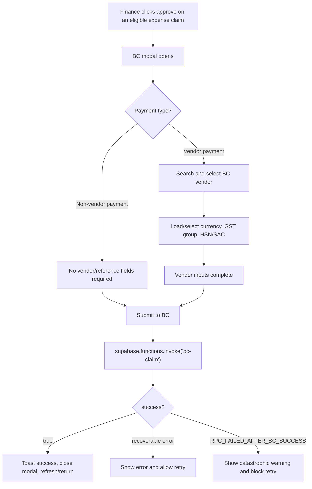

Modal sections:

1. Payment Type
   - Non-Vendor Payment: reimburse employee directly.
   - Vendor Payment: pay a third-party vendor.
2. Vendor
   - Only shown for vendor payments.
   - Uses `bc-vendor-search`.
3. Reference Codes
   - Only shown for vendor payments.
   - Currency and GST group load when vendor mode is selected.
   - HSN/SAC is search-as-you-type.

Submit gating:

- Submit is disabled until payment type is chosen.
- Vendor payment requires selected vendor, currency code, GST group code, and
  HSN/SAC code.
- Modal cannot close while submission is in flight.
- Catastrophic local-sync failure blocks retry and tells user to contact admin.

## Successful BC Claim Submission Sequence

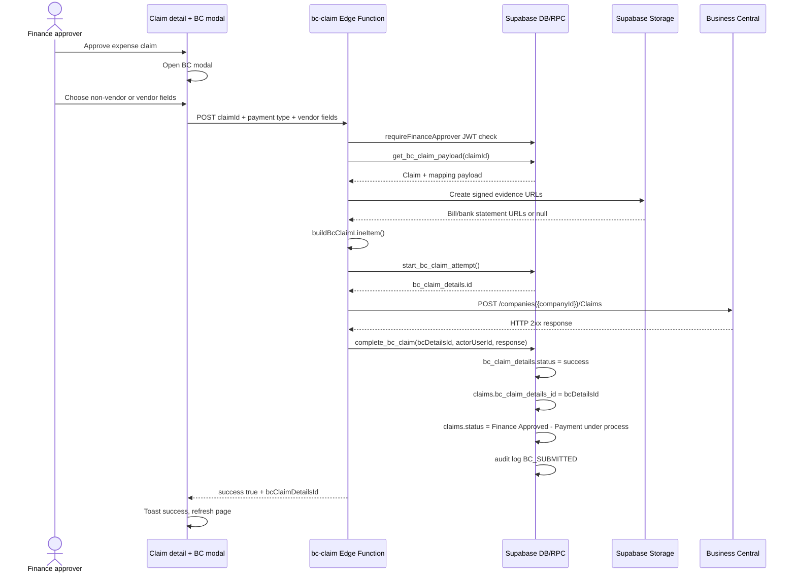

## Failure And Retry Sequence

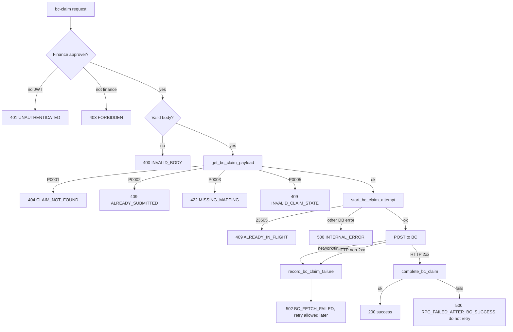

Failure behavior:

| Failure                                 | HTTP returned                     | Retry behavior                                                   |
| --------------------------------------- | --------------------------------- | ---------------------------------------------------------------- |
| Missing/invalid JWT                     | `401 UNAUTHENTICATED`             | User must sign in again.                                         |
| User is not active finance approver     | `403 FORBIDDEN`                   | Not retryable by same user unless role changes.                  |
| Invalid modal body                      | `400 INVALID_BODY`                | Fix client/input.                                                |
| Claim missing/inactive                  | `404 CLAIM_NOT_FOUND`             | Not retryable unless data restored.                              |
| Already successfully submitted          | `409 ALREADY_SUBMITTED`           | Do not retry.                                                    |
| Another active attempt exists           | `409 ALREADY_IN_FLIGHT`           | Retry after in-flight attempt completes/fails.                   |
| Required mapping missing                | `422 MISSING_MAPPING`             | Admin must fix mapping, then retry.                              |
| Claim in wrong status                   | `409 INVALID_CLAIM_STATE`         | Only eligible after HOD approval and before BC/finance approval. |
| BC rejects request or times out         | `502 BC_FETCH_FAILED`             | Failed attempt is recorded; retry after issue fixed.             |
| BC accepted but local completion failed | `500 RPC_FAILED_AFTER_BC_SUCCESS` | Do not retry; manual reconciliation required.                    |

## Database RPC Functions

### `get_bc_claim_payload(p_claim_id text)`

Purpose:

- Load and validate all NxtClaim data required to build the Business Central
  line-item payload.

Security:

- `SECURITY DEFINER`
- `SET search_path = public, pg_temp`
- Execute revoked from public, anon, authenticated.
- Execute granted to service role only.

Validation:

1. Claim must exist.
2. Claim must be active.
3. Claim must have a joined payment mode.
4. Claim must not already have `claims.bc_claim_details_id`.
5. Claim status must be `HOD approved - Awaiting finance approval`.
6. Claim must have active expense details.
7. Expense category must have active BC GL mapping.
8. Product must have active program mapping.
9. Product must have active sub-product mapping.
10. Department must have active responsible/beneficiary department mapping.
11. Location must have active region mapping.

Returned JSON:

```json
{
  "claim_id": "CLAIM-NW0001234-20260520-ABCD",
  "payment_mode_name": "Reimbursement",
  "submission_type": "Self",
  "employee_id": "NW0001234",
  "on_behalf_employee_code": null,
  "employee_name": "Employee Name",
  "program_code": "COMMON",
  "sub_product_code": "COMMON",
  "responsible_department_code": "TECHNOLOGY",
  "beneficiary_department_code": "TECHNOLOGY",
  "region_code": "COMMON",
  "bill_no": "INV-001",
  "transaction_date": "2026-05-20",
  "purpose": "Software subscription",
  "receipt_file_path": "claims/receipt.pdf",
  "bank_statement_file_path": "claims/bank.pdf",
  "bc_code": "503063",
  "basic_amount": 1000,
  "total_amount": 1180,
  "foreign_basic_amount": 0,
  "foreign_total_amount": 0
}
```

SQLSTATE mappings:

| SQLSTATE | Meaning               |
| -------- | --------------------- |
| `P0001`  | `CLAIM_NOT_FOUND`     |
| `P0002`  | `ALREADY_SUBMITTED`   |
| `P0003`  | `MISSING_MAPPING`     |
| `P0005`  | `INVALID_CLAIM_STATE` |

### `start_bc_claim_attempt(p_claim_id, p_is_vendor_payment, p_payload_json)`

Purpose:

- Insert a `bc_claim_details` row before calling Business Central.
- Claim an in-flight slot for the claim.

Inserted values:

```text
claim_id = p_claim_id
is_vendor_payment = p_is_vendor_payment
bc_status = submitting
bc_payload_json = p_payload_json
bc_response_json = null
```

Return:

- New `bc_claim_details.id`.

### `complete_bc_claim(p_bc_details_id, p_actor_user_id, p_response_json)`

Purpose:

- Complete the local state transition after BC accepts the payload.

Workflow:

1. Update `bc_claim_details` row from `submitting` to `success`.
2. Store `bc_response_json`.
3. Link `claims.bc_claim_details_id`.
4. Move claim status to `Finance Approved - Payment under process`.
5. Insert claim audit log with action `BC_SUBMITTED`.

If the detail row is not in `submitting`, the function raises `P0004`.

### `record_bc_claim_failure(p_bc_details_id, p_actor_user_id, p_response_json)`

Purpose:

- Record a failed BC submission attempt.

Workflow:

1. Update `bc_claim_details` row from `submitting` to `failed`.
2. Store BC error/network/timeout response JSON.
3. Leave `claims.bc_claim_details_id` unchanged.
4. Leave `claims.status` unchanged.
5. Insert claim audit log with action `BC_SUBMISSION_FAILED`.

This makes retry possible because failed attempts do not block the partial
unique index.

## Payload Builder

Code:

```text
supabase/functions/bc-claim/payloadBuilder.ts
supabase/functions/bc-claim/types.ts
```

The builder creates one flat object posted to:

```text
/companies({BC_COMPANY_ID})/Claims
```

The custom API base path is:

```text
/v2.0/{BC_ENVIRONMENT}/api/Alletec/Claim/v1.0
```

Full URL shape:

```text
https://api.businesscentral.dynamics.com/v2.0/{BC_ENVIRONMENT}/api/Alletec/Claim/v1.0/companies({BC_COMPANY_ID})/Claims
```

## Payload Fields

### Always Sent

| Payload key               | Source                                                               | Rule                                                                      |
| ------------------------- | -------------------------------------------------------------------- | ------------------------------------------------------------------------- |
| `documentType`            | Constant                                                             | `Invoice`                                                                 |
| `locationCode`            | Constant                                                             | `HBT`                                                                     |
| `type`                    | Constant                                                             | `G/L Account`                                                             |
| `quantity`                | Constant                                                             | `1`                                                                       |
| `gstCredit`               | Constant                                                             | `Non-Availment`                                                           |
| `gstSubcategory`          | Constant                                                             | `Ineligible-43/44`                                                        |
| `employeeTransactionType` | Constant                                                             | `Advance`                                                                 |
| `documentDate`            | DB payload                                                           | Expense transaction date / bill date.                                     |
| `glCode`                  | `expense_category_bc_mappings.bc_code`                               | GL code from expense category.                                            |
| `employeeId`              | DB payload                                                           | Self: `employee_id`; On Behalf: `on_behalf_employee_code`.                |
| `employeeName`            | DB payload                                                           | Resolved submitter or beneficiary name in `get_bc_claim_payload`.         |
| `claimNo`                 | Claim ID                                                             | Passed through in full. BC rejects if too long.                           |
| `remarks`                 | Builder                                                              | Claim ID + purpose + signed evidence URLs.                                |
| `programCode`             | `master_program_product_mappings.program_code`                       | Product mapping.                                                          |
| `subproductCode`          | `master_sub_product_mappings.sub_product_code`                       | Product mapping.                                                          |
| `responsibleDepartment`   | `master_department_responsible_mappings.responsible_department_code` | Department mapping.                                                       |
| `beneficiaryDepartment`   | `master_department_responsible_mappings.beneficiary_department_code` | Department mapping.                                                       |
| `regionCode`              | `master_expense_location_mappings.region_code`                       | Location mapping.                                                         |
| `invoiceRequired`         | Finance modal                                                        | `true` for vendor payment, `false` for non-vendor.                        |
| `paymentRequired`         | Payment mode                                                         | `true` only when payment mode is `Reimbursement`, case/space insensitive. |
| `ammountLCY`              | Amount rule                                                          | See amount rules below.                                                   |
| `Ammount`                 | Amount rule                                                          | See amount rules below.                                                   |
| `currencyCode`            | Rule                                                                 | Non-vendor: `INR`; vendor: selected currency.                             |

The misspelled/case-sensitive keys `ammountLCY` and `Ammount` are intentional
because they match the Business Central custom API spec used by the code.

### Vendor-Only Fields

These keys are omitted entirely for non-vendor claims. They are not sent as
`null` or empty strings except for `vendorInvoiceNo`, which can be an empty
string when the bill number is null.

| Payload key       | Source                                        |
| ----------------- | --------------------------------------------- |
| `vendorInvoiceNo` | Claim bill number, or empty string if absent. |
| `vendorCode`      | Selected BC vendor number.                    |
| `vendorName`      | Selected BC vendor display name.              |
| `gstGroupCode`    | Selected BC GST group code.                   |
| `hsnSacCode`      | Selected BC HSN/SAC code.                     |

## Amount Rules

Vendor payment:

```text
ammountLCY = basic_amount
Ammount    = foreign_basic_amount if > 0, otherwise basic_amount
```

Non-vendor payment:

```text
ammountLCY = total_amount
Ammount    = foreign_total_amount if > 0, otherwise total_amount
```

Why there are two amount fields:

- `ammountLCY` represents local-currency amount.
- `Ammount` represents the amount in the transaction currency according to the
  BC API field naming.
- Non-foreign domestic claims normally have zero foreign amounts, so the builder
  falls back to local total/basic amounts.

## Remarks Rules

Remarks are built by `buildRemarks`.

Base format:

```text
{claim_id} - {purpose}
```

If bill URL exists:

```text
bill - {signed_bill_url}
```

If bank statement URL exists:

```text
bank statement - {signed_bank_statement_url}
```

Full example:

```text
CLAIM-NW0001234-20260520-ABCD - Software subscription
bill - https://...
bank statement - https://...
```

Signed URL behavior:

- The edge function signs files from the private `claims` storage bucket.
- Expiry is 10 years.
- If signing fails, the function logs a warning and continues with a null URL.

## On-Behalf Employee Resolution

For `submission_type = Self`:

```text
employeeId = employee_id
employeeName = submitter full_name
```

For `submission_type = On Behalf`:

```text
employeeId = on_behalf_employee_code
employeeName = beneficiary full_name
```

This matches the workbook model where Business Central needs the beneficiary
employee identity, not the acting submitter, for on-behalf claims.

## CSV Contract Analysis

File:

```text
nxtclaim table creation(Sheet1).csv
```

The CSV has 29 columns and describes the custom Business Central claim payload
expected by the Dynamics team.

CSV columns:

| #   | CSV column                  | CSV note                          | Current code mapping                                                                         |
| --- | --------------------------- | --------------------------------- | -------------------------------------------------------------------------------------------- |
| 1   | `Document Type`             | Fixed value                       | `documentType = Invoice`                                                                     |
| 2   | `No.`                       | Sequence from Dynamics            | Not sent by current code; BC/custom API is expected to generate/handle it.                   |
| 3   | `Location Code`             | Fixed value                       | `locationCode = HBT`                                                                         |
| 4   | `Currency Code`             | List from Dynamics; human selects | Non-vendor `INR`; vendor selected through `bc-reference?type=currencies`.                    |
| 5   | `Vendor Invoice No.`        | Bill number; vendor only          | `vendorInvoiceNo = bill_no` for vendor payment only.                                         |
| 6   | `Document Date`             | Bill date                         | `documentDate = transaction_date`                                                            |
| 7   | `Line No.`                  | Fixed/dynamics                    | Not sent by current code.                                                                    |
| 8   | `Type`                      | Fixed value                       | `type = G/L Account`                                                                         |
| 9   | `Quantity`                  | Fixed value                       | `quantity = 1`                                                                               |
| 10  | `GST Group Code`            | List from Dynamics; vendor        | `gstGroupCode` selected through `bc-reference?type=gstGroupCodes` for vendor payment only.   |
| 11  | `GST Credit`                | Fixed value                       | `gstCredit = Non-Availment`                                                                  |
| 12  | `HSN/SAC Code`              | List from Dynamics; vendor        | `hsnSacCode` selected through `bc-reference?type=hsnSacCodes` for vendor payment only.       |
| 13  | `GST Subcategory`           | Fixed value                       | `gstSubcategory = Ineligible-43/44`                                                          |
| 14  | `Employee Id`               | Employee/beneficiary ID           | `employeeId` resolved from claim submission type.                                            |
| 15  | `Employee name`             | Employee/beneficiary name         | `employeeName` resolved by DB function.                                                      |
| 16  | `Vendor code`               | Vendor code                       | `vendorCode` selected through `bc-vendor-search`, vendor only.                               |
| 17  | `Vendor name`               | Vendor name                       | `vendorName` selected through `bc-vendor-search`, vendor only.                               |
| 18  | `GL code`                   | Expense category                  | `glCode = expense_category_bc_mappings.bc_code`                                              |
| 19  | `Employee transaction type` | Fixed value                       | `employeeTransactionType = Advance`                                                          |
| 20  | `Remarks`                   | Claim ID + purpose + proof links  | `remarks = buildRemarks(...)`                                                                |
| 21  | `Claim no`                  | Claim ID                          | `claimNo = claim_id`                                                                         |
| 22  | `Program code`              | List/from mappings                | `programCode = master_program_product_mappings.program_code`                                 |
| 23  | `Subproduct code`           | List/from mappings                | `subproductCode = master_sub_product_mappings.sub_product_code`                              |
| 24  | `Responsible department`    | List/from mappings                | `responsibleDepartment = master_department_responsible_mappings.responsible_department_code` |
| 25  | `Beneficiary department`    | List/from mappings                | `beneficiaryDepartment = master_department_responsible_mappings.beneficiary_department_code` |
| 26  | `Region code`               | List/from mappings                | `regionCode = master_expense_location_mappings.region_code`                                  |
| 27  | `Processed`                 | Dynamics-side flag                | Not sent by current code.                                                                    |
| 28  | `Invoice required`          | `true` for vendor payment         | `invoiceRequired = isVendorPayment`                                                          |
| 29  | `Payment required`          | True only for reimbursement       | `paymentRequired = lower(payment_mode_name) == reimbursement`                                |

Additional current-code fields not shown in the CSV:

| Payload key  | Meaning                      |
| ------------ | ---------------------------- |
| `ammountLCY` | Local-currency amount.       |
| `Ammount`    | Transaction-currency amount. |

Important interpretation:

- The CSV is closest to the current custom Claims API contract.
- The code intentionally does not send `No.`, `Line No.`, or `Processed`.
- The code includes `ammountLCY` and `Ammount`, which appear to be later API
  requirements not represented in the CSV.

## Workbook Analysis

File:

```text
BC.xlsx
```

Workbook tabs:

| Sheet    | Used range | Non-empty rows | Purpose                                                                                  |
| -------- | ---------- | -------------- | ---------------------------------------------------------------------------------------- |
| `V2`     | A1:AV213   | 212            | NxtClaim export enriched with formulas for BC fields.                                    |
| `Sheet1` | A1:AM3364  | 3364           | Lookup/master data source for employee IDs, mappings, locations, departments, and names. |
| `BC`     | A1:N212    | 212            | Business Central journal-style transformed output from the V2 data.                      |

## Workbook Sheet Structure

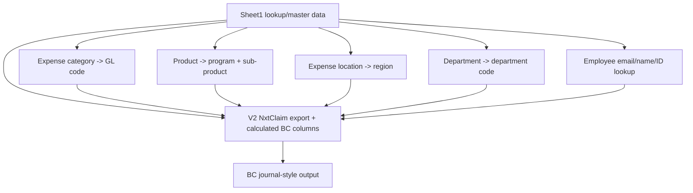

## `V2` Sheet

The `V2` sheet is an exported claims dataset with additional calculated BC
columns.

Observed dimensions:

- Row count: 1000 worksheet rows.
- Non-empty rows: 212.
- Used range: A1:AV213.
- Formula count: 1055.

Main source columns:

| Column | Header                   | Meaning                                      |
| ------ | ------------------------ | -------------------------------------------- |
| A      | Claim ID                 | NxtClaim claim ID.                           |
| B      | Employee ID              | Source employee ID from export.              |
| C      | Beneficiary Employee ID  | Beneficiary employee ID.                     |
| D      | Submitter Employee ID    | Acting submitter employee ID.                |
| E      | Employee Email           | Beneficiary/employee email used for lookups. |
| F      | Employee Name            | Employee name.                               |
| G      | Department               | NxtClaim department.                         |
| H      | Petty Cash Balance       | Wallet/petty cash value.                     |
| I      | Submitter                | Submitter name.                              |
| J      | Submitter Email          | Submitter email.                             |
| K      | Payment Mode             | Payment mode.                                |
| L      | Submission Type          | Self or On Behalf.                           |
| M      | Purpose                  | Claim purpose.                               |
| N      | Blank header             | Formula: `Claim ID + " - " + Purpose`.       |
| O      | Claim Raised Date        | Submitted date.                              |
| P      | HOD Approved Date        | HOD approval date.                           |
| Q      | Finance Approved Date    | Finance approval date.                       |
| R      | Bill Date                | Transaction/bill date.                       |
| S      | Claim Status             | Claim status.                                |
| T      | Bill Number              | Bill/invoice number.                         |
| U      | Basic Amount             | Basic amount.                                |
| V      | CGST                     | CGST amount.                                 |
| W      | SGST                     | SGST amount.                                 |
| X      | IGST                     | IGST amount.                                 |
| Y      | Total Amount             | Total amount.                                |
| Z      | Vendor Name              | Vendor/merchant from claim.                  |
| AA     | Transaction Category     | Expense category.                            |
| AB     | Product                  | NxtClaim product.                            |
| AC     | Expense Location         | NxtClaim location.                           |
| AD     | Location Type            | Base/outstation/etc.                         |
| AE     | Location Details         | Free-form details.                           |
| AF     | Bank Statement URL       | Evidence.                                    |
| AG     | Bill URL                 | Evidence.                                    |
| AH     | Petty Cash Photo URL     | Evidence.                                    |
| AI     | Petty Cash Request Month | Petty cash request info.                     |
| AJ     | Claim Remarks            | Claim remarks.                               |
| AK     | Transaction Remarks      | Transaction remarks.                         |

Calculated BC-like columns:

| Column | Header                    | Formula/source                                                    |
| ------ | ------------------------- | ----------------------------------------------------------------- |
| AM     | Account Type              | Fixed value, usually `Employee`.                                  |
| AN     | Account No.               | `XLOOKUP(E, Sheet1!C:C, Sheet1!A:A)` to map email to employee ID. |
| AO     | Employee Transaction Type | Fixed value `ADVANCE`.                                            |
| AP     | Amount                    | `-ABS(Y)` to convert total amount to negative employee amount.    |
| AQ     | Bal. Account Type         | Fixed value `G/L Account`.                                        |
| AR     | Bal. Account No.          | `XLOOKUP(AA, Sheet1!O:O, Sheet1!P:P)` category to GL.             |
| AS     | Sub product Code          | `XLOOKUP(AB, Sheet1!S:S, Sheet1!T:T)` product to sub-product.     |
| AT     | Beneficiary dep Code      | `XLOOKUP(G, Sheet1!Y:Y, Sheet1!Z:Z)` department to code.          |
| AU     | Region                    | `XLOOKUP(AC, Sheet1!V:V, Sheet1!W:W)` location to region.         |
| AV     | Blank header              | Some rows mark `Vendor Payment`.                                  |

Observed `V2` examples:

- Most rows are `Finance Approved - Payment under process`.
- Payment modes include Petty Cash, Reimbursement, Petty Cash Request, and
  Happay.
- Frequent categories include Food, Travel Domestic, Fuel Expense, Overseas
  Subscription, Brand Promotion, Printing & Stationery.

How current code uses this model:

- The code does not read `BC.xlsx`.
- The formulas in `V2` informed the database mapping tables and the payload
  builder.
- Current code performs the same category/product/department/location mapping
  in `get_bc_claim_payload`, using database tables instead of Excel formulas.

## `Sheet1` Sheet

`Sheet1` contains multiple independent lookup blocks.

Observed blocks:

| Block                     | Columns | Rows observed                 | Meaning                                                    |
| ------------------------- | ------- | ----------------------------- | ---------------------------------------------------------- |
| Employee master           | A:G     | 3363 data rows                | Employee ID, name, email, bank details, employment status. |
| Category map              | O:P     | 22 data rows                  | Expense category to BC GL code.                            |
| Product map               | R:T     | 16 data rows                  | Program code, NxtClaim product, sub-product code.          |
| Location map              | V:W     | 77 data rows                  | Expense location to region code.                           |
| Department map            | Y:Z     | 53 data rows, 6 missing codes | Department to department code.                             |
| Unique beneficiary helper | AE:AG   | 52 data rows                  | Unique employee IDs and names used by workbook formulas.   |
| Employee name directory   | AJ:AK   | 2170 data rows                | Employee number to first/name lookup.                      |
| Additional NIAT locations | AM      | 15 data rows                  | Additional location names.                                 |

### Category Map

This block maps NxtClaim categories to GL codes.

Examples:

| Category                                     | BC GL code |
| -------------------------------------------- | ---------- |
| Food                                         | `503063`   |
| Accommodation Domestic                       | `535004`   |
| Accommodation Overseas                       | `535005`   |
| Fuel Expense                                 | `535002`   |
| Travel Domestic                              | `535001`   |
| Travel Overseas                              | `535003`   |
| Local Subscription                           | `533501`   |
| Overseas Subscription                        | `533502`   |
| Repairs & Maintenance - Office               | `533401`   |
| Repairs & Maintenance - Electronic Equipment | `533402`   |
| Postal Charges                               | `536011`   |
| Printing & Stationery                        | `536012`   |
| Team outing                                  | `503067`   |
| Miscellaneous expenses                       | `536007`   |
| Offline Marketing                            | `505118`   |
| Other Staff Welfare                          | `503065`   |
| Rates & Taxes                                | `532504`   |
| Internet Expense                             | `530097`   |
| Brand Promotion                              | `505121`   |
| Other Professional charges                   | `505005`   |
| Training & Conference                        | `503066`   |
| Employee Car Lease                           | `503008`   |

Current database table:

```text
expense_category_bc_mappings
```

Current seed migration:

```text
supabase/migrations/20260507103000_seed_expense_category_bc_mappings.sql
```

### Product Map

This block maps NxtClaim products to program/sub-product codes.

Examples:

| Program code        | Product                   | Sub-product code |
| ------------------- | ------------------------- | ---------------- |
| `CCBP 4.0 ACADEMY`  | Academy Online            | `AO107`          |
| `CCBP 4.0 ACADEMY`  | Academy College Plus      | `ACP202`         |
| `INTENSIVE 3.0`     | Intensive Online          | `IO253`          |
| `INTENSIVE OFFLINE` | Intensive Offline         | `IO256`          |
| `INTENSIVE 3.0`     | Intensive College Plus    | `ICP302`         |
| `NIAT`              | NIAT Batch 2023           | `NIAT354`        |
| `NIAT`              | NIAT Batch 2024           | `NIAT354`        |
| `NIAT`              | NIAT Batch 2025           | `NIAT362`        |
| `NIAT`              | NIAT Batch 2026           | `NIAT362`        |
| `NIAT`              | NIAT Application          | `NIAT355`        |
| `NIAT`              | NIAT DS Transport         | `NIAT356`        |
| `NXTWAVE ABROAD`    | NxtWave Abroad Service    | `NWA401`         |
| `NXTWAVE ABROAD`    | NxtWave Abroad Commission | `NWA402`         |
| `TOPIN.TECH`        | Topin.tech                | `TOPIN452`       |
| `COMMON`            | Common                    | `COMMON`         |
| `NIFA`              | NIFA                      | `NFA100`         |

Current database tables:

```text
master_program_product_mappings
master_sub_product_mappings
```

### Location Map

This block maps NxtClaim expense locations to region codes.

Examples:

| Location             | Region code     |
| -------------------- | --------------- |
| Presales-Bangalore   | `KANNADA`       |
| Presales-Chennai     | `TAMIL`         |
| Presales-Hyderabad   | `TELUGU`        |
| Presales-Delhi       | `HINDI`         |
| Office - Hyd Brigade | `COMMON`        |
| Office - Hyd KKH     | `COMMON`        |
| NIAT - Aurora        | `NIAT - AURORA` |
| NIAT - ADYPU         | `NIAT - ADYPU`  |
| Other                | `COMMON`        |

Current database table:

```text
master_expense_location_mappings
```

### Department Map

This block maps NxtClaim departments to BC department codes.

Examples:

| Department                        | Code                  |
| --------------------------------- | --------------------- |
| Pre-Sales                         | `PRE-SALES`           |
| Sales                             | `SALES`               |
| Branding                          | `BRANDING`            |
| GenAI Social Media                | `GENAI SOCIAL MEDIA`  |
| Placement - Corporate Relations   | `PLAC-CORP-OPS`       |
| Student Success - Academy         | `STUDENT SUCCESS-ACD` |
| Technology                        | `TECHNOLOGY`          |
| Finance                           | `FIN-OPR ANALYSIS`    |
| NIAT Offline Lead Generation Team | `PRE-SALES`           |
| Employee Car Lease                | `HR-OPR & PAYROLL`    |

Rows observed with blank department codes in the workbook:

```text
Marketing
Management
Content Marketing
Graphic Design
NXTINTERN
Test
```

Current database table:

```text
master_department_responsible_mappings
```

Current code requires an active department mapping. If a claim uses an unmapped
active department, `get_bc_claim_payload` fails with `MISSING_MAPPING`.

## `BC` Sheet

The `BC` sheet is a transformed journal-style output.

Observed dimensions:

- Used range: A1:N212.
- Non-empty rows: 212.
- Formula count: 1.

Columns:

| Column | Header                    | Meaning                                                           |
| ------ | ------------------------- | ----------------------------------------------------------------- |
| A      | Posting Date              | Date for BC posting.                                              |
| B      | Document No.              | Dynamics team handles document number.                            |
| C      | Account Type              | Employee or Vendor.                                               |
| D      | Account No.               | Employee ID or vendor code.                                       |
| E      | Employee Transaction Type | Usually `ADVANCE`.                                                |
| F      | Amount                    | Negative for employee rows; positive for vendor rows in examples. |
| G      | Description               | Claim ID + purpose.                                               |
| H      | Bal. Account Type         | Fixed `G/L Account`.                                              |
| I      | Bal. Account No.          | GL code.                                                          |
| J      | Program Code              | Program code.                                                     |
| K      | Sub product Code          | Sub-product code.                                                 |
| L      | Responsible dep Code      | Department code.                                                  |
| M      | Beneficiary dep Code      | Department code.                                                  |
| N      | Region Code               | Location/region code.                                             |

Important difference from current code:

- The `BC` sheet shows a journal-style structure with `Account Type`,
  `Account No.`, `Bal. Account Type`, and `Bal. Account No.`.
- Vendor examples in the workbook appear as paired employee/vendor rows.
- The current `bc_int` code posts one custom Claims API payload object, not the
  `BC` sheet row shape.
- The CSV custom payload is closer to the current code than the `BC` sheet is.

Observed workbook issue:

- `BC!F211` contains formula `SUM(L213travel)` and evaluates to `#NAME?`.
- `BC!A212:N212` contains a department-code correction row rather than a normal
  claim row.

These workbook issues do not affect runtime because the application does not
read the workbook.

## Sheet To Code Mapping

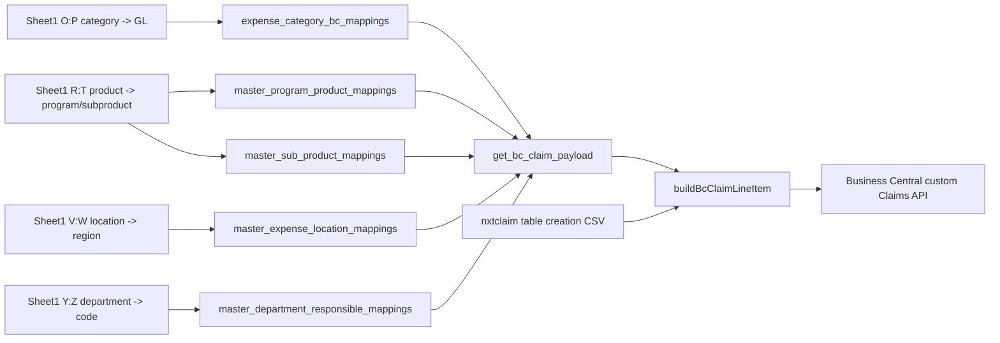

## Payload Construction Data Flow

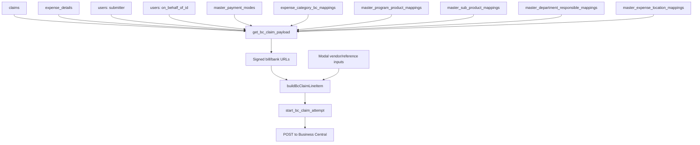

## Non-Vendor Payment Scenario

Finance modal input:

```json
{
  "claimId": "CLAIM-NW0001234-20260520-ABCD",
  "isVendorPayment": false
}
```

Workflow:

1. Finance chooses Non-Vendor Payment.
2. No vendor search is required.
3. No currency/GST/HSN selection is required.
4. Payload uses `currencyCode = INR`.
5. Vendor-only fields are omitted.
6. `invoiceRequired = false`.
7. `paymentRequired = true` only if payment mode is reimbursement.
8. Amount uses total amount rules.
9. BC receives one custom Claims API payload.

Non-vendor amount example:

```text
basic_amount = 1000
total_amount = 1180
foreign_total_amount = 0

ammountLCY = 1180
Ammount = 1180
```

## Vendor Payment Scenario

Finance modal input:

```json
{
  "claimId": "CLAIM-NW0001234-20260520-ABCD",
  "isVendorPayment": true,
  "bcVendorCode": "VEN/0012345",
  "bcVendorName": "Example Vendor Pvt Ltd",
  "currencyCode": "USD",
  "gstGroupCode": "GST18",
  "hsnSacCode": "998314"
}
```

Workflow:

1. Finance chooses Vendor Payment.
2. Modal loads currency and GST group references.
3. Finance searches vendor by name or number.
4. Modal calls `bc-vendor-search`.
5. Finance selects a vendor.
6. Finance searches/selects HSN/SAC.
7. Modal validates all vendor fields.
8. `bc-claim` validates vendor fields again with Zod.
9. Payload uses selected vendor code/name, selected currency, GST group, and
   HSN/SAC.
10. `invoiceRequired = true`.
11. Amount uses basic amount rules.

Vendor amount example:

```text
basic_amount = 1000
total_amount = 1180
foreign_basic_amount = 12
foreign_total_amount = 14

ammountLCY = 1000
Ammount = 12
```

If `foreign_basic_amount = 0`:

```text
Ammount = basic_amount
```

## Vendor And Reference Search Workflow

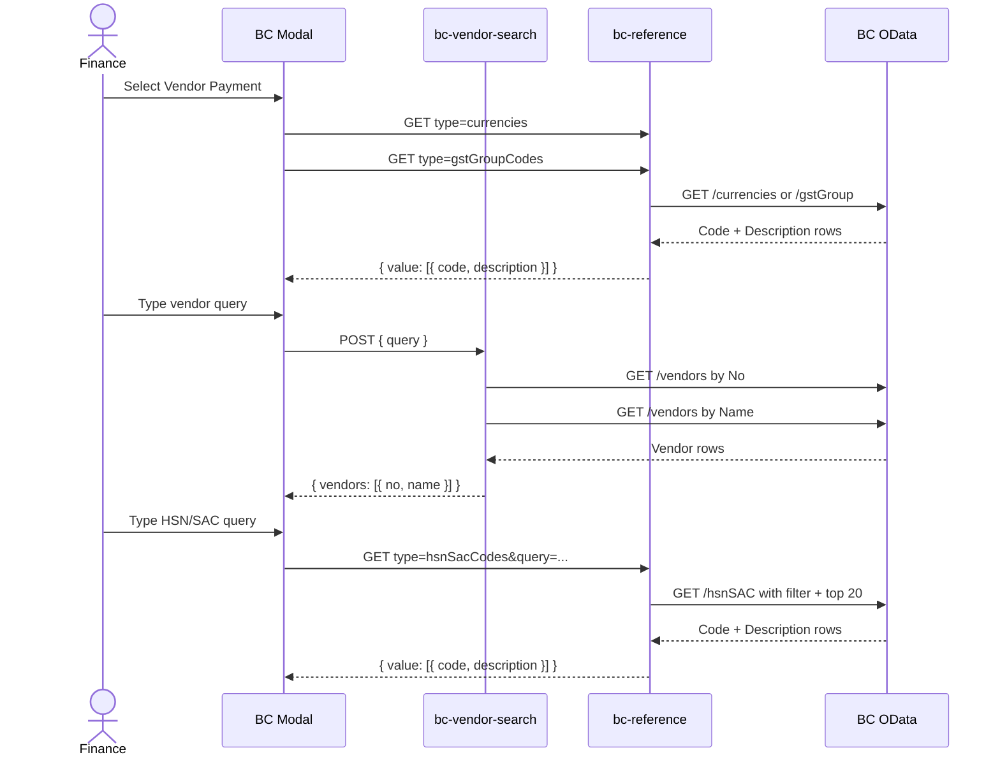

## Authentication And Authorization

### Edge Function Auth

Shared auth helper:

```text
supabase/functions/_shared/auth.ts
```

`requireAuthenticatedUser(req)`:

1. Reads bearer token from `Authorization`.
2. Uses Supabase service-role client.
3. Calls `admin.auth.getUser(jwt)`.
4. Returns user ID if token is valid.

`requireFinanceApprover(req)`:

1. Calls `requireAuthenticatedUser`.
2. Looks up `master_finance_approvers`.
3. Requires `user_id = auth user ID`.
4. Requires `is_active = true`.

`bc-claim` requires finance approver.

`bc-reference` and `bc-vendor-search` require authenticated user.

### Database Function Access

BC mutation functions are service-role only:

```text
get_bc_claim_payload
start_bc_claim_attempt
complete_bc_claim
record_bc_claim_failure
```

Execute is revoked from:

```text
PUBLIC
anon
authenticated
```

Execute is granted to:

```text
service_role
```

This means browser users cannot call the database transition functions directly.
They must go through the edge function, which enforces finance authorization.

## CORS Behavior

Code:

```text
supabase/functions/_shared/cors.ts
```

Behavior:

- Preflight requests are allowed only when the `Origin` is in
  `BC_ALLOWED_ORIGINS`.
- Real requests are not rejected only because of origin. Auth is the real
  protection.
- Server-to-server calls without `Origin` continue to work.

Implementation note:

- `BASE_HEADERS` currently lists allowed methods as `POST, OPTIONS`.
- `bc-reference` uses `GET`.
- If browser calls to `bc-reference` encounter preflight/CORS problems, verify
  whether `GET` needs to be included in `Access-Control-Allow-Methods`.

## Logging

Code:

```text
supabase/functions/_shared/logger.ts
```

Logs are one-line JSON entries.

Stable fields:

```json
{
  "ts": "2026-05-27T00:00:00.000Z",
  "fn": "bc-claim",
  "level": "info",
  "event": "request_start"
}
```

Important logging rules:

- Do not log bearer tokens.
- Do not log Authorization headers.
- Do not log user PII beyond auth UUID.
- Truncate raw BC error bodies before logging.

Important `bc-claim` events:

| Event                                      | Meaning                                             |
| ------------------------------------------ | --------------------------------------------------- |
| `request_start`                            | Edge function request started.                      |
| `auth_failed`                              | JWT missing/invalid or user not finance.            |
| `payload_loaded`                           | DB payload loaded successfully.                     |
| `sign_url_failed`                          | Evidence URL signing failed but workflow continues. |
| `attempt_started`                          | `bc_claim_details` row inserted.                    |
| `bc_post_outcome`                          | BC API call completed or threw.                     |
| `attempt_failed`                           | BC non-2xx response.                                |
| `record_failure_rpc_failed`                | Failure row update failed.                          |
| `catastrophic_rpc_failed_after_bc_success` | BC accepted but local completion failed.            |
| `attempt_completed`                        | Local completion finished after BC success.         |

## UI Error Messages

The modal maps structured edge-function errors to user-facing messages.

| Error code                    | User behavior                            |
| ----------------------------- | ---------------------------------------- |
| `UNAUTHENTICATED`             | Ask user to sign in again.               |
| `FORBIDDEN`                   | User cannot submit to BC.                |
| `INVALID_BODY`                | Show invalid input details.              |
| `CLAIM_NOT_FOUND`             | Claim no longer exists.                  |
| `ALREADY_SUBMITTED`           | Claim was already submitted to BC.       |
| `ALREADY_IN_FLIGHT`           | Another submission is in progress.       |
| `MISSING_MAPPING`             | Mapping missing; contact admin.          |
| `INVALID_CLAIM_STATE`         | Claim is not eligible for BC submission. |
| `INTERNAL_ERROR`              | Generic server-side failure.             |
| `BC_FETCH_FAILED`             | BC rejected request or network failed.   |
| `RPC_FAILED_AFTER_BC_SUCCESS` | Catastrophic; do not retry.              |

## Runtime Data Contract

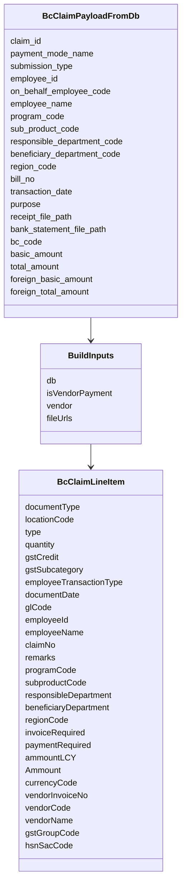

## Successful Non-Vendor Payload Example

```json
{
  "documentType": "Invoice",
  "locationCode": "HBT",
  "type": "G/L Account",
  "quantity": 1,
  "gstCredit": "Non-Availment",
  "gstSubcategory": "Ineligible-43/44",
  "employeeTransactionType": "Advance",
  "documentDate": "2026-05-10",
  "glCode": "503063",
  "employeeId": "NW0001234",
  "employeeName": "Employee Name",
  "claimNo": "CLAIM-NW0001234-20260510-ABCD",
  "remarks": "CLAIM-NW0001234-20260510-ABCD - Food bill",
  "programCode": "COMMON",
  "subproductCode": "COMMON",
  "responsibleDepartment": "TECHNOLOGY",
  "beneficiaryDepartment": "TECHNOLOGY",
  "regionCode": "COMMON",
  "invoiceRequired": false,
  "paymentRequired": true,
  "ammountLCY": 1180,
  "Ammount": 1180,
  "currencyCode": "INR"
}
```

## Successful Vendor Payload Example

```json
{
  "documentType": "Invoice",
  "locationCode": "HBT",
  "type": "G/L Account",
  "quantity": 1,
  "gstCredit": "Non-Availment",
  "gstSubcategory": "Ineligible-43/44",
  "employeeTransactionType": "Advance",
  "documentDate": "2026-05-10",
  "glCode": "533502",
  "employeeId": "NW0009999",
  "employeeName": "Beneficiary Person",
  "claimNo": "CLAIM-NW0009999-20260510-DCBA",
  "remarks": "CLAIM-NW0009999-20260510-DCBA - Software subscription\nbill - https://...",
  "programCode": "COMMON",
  "subproductCode": "COMMON",
  "responsibleDepartment": "TECHNOLOGY",
  "beneficiaryDepartment": "TECHNOLOGY",
  "regionCode": "COMMON",
  "invoiceRequired": true,
  "paymentRequired": false,
  "ammountLCY": 5000,
  "Ammount": 80,
  "currencyCode": "USD",
  "vendorInvoiceNo": "INV-2026-001",
  "vendorCode": "VEN/0012475",
  "vendorName": "Example Vendor",
  "gstGroupCode": "GST18",
  "hsnSacCode": "998314"
}
```

## Full Workflow From Claim Submission To BC

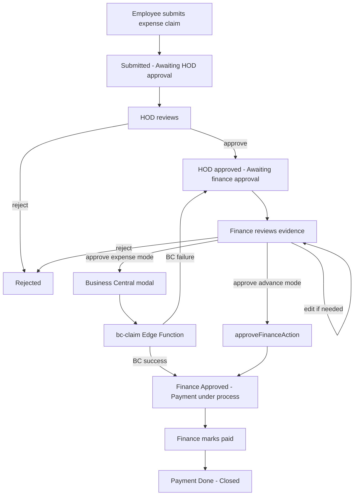

## How The Current Code Replaces The Workbook Formula Model

Workbook formula model:

```text
Excel export row
  -> XLOOKUP category to GL code
  -> XLOOKUP product to sub-product
  -> XLOOKUP department to department code
  -> XLOOKUP location to region
  -> manual/derived BC rows
```

Runtime model:

```text
Claim ID
  -> get_bc_claim_payload()
  -> SQL joins mapping tables
  -> buildBcClaimLineItem()
  -> start_bc_claim_attempt()
  -> POST Business Central custom Claims API
  -> complete_bc_claim() or record_bc_claim_failure()
```

Why this matters:

- Runtime no longer depends on Excel formulas.
- Missing mappings fail deterministically with `MISSING_MAPPING`.
- Every attempt is stored in `bc_claim_details`.
- Successful submission links to the claim.
- Failed attempts remain audit history and allow retry.

## Source Of Truth By Data Type

| Data                               | Runtime source of truth                                     |
| ---------------------------------- | ----------------------------------------------------------- |
| Claim identity/status/payment mode | `claims`, `master_payment_modes`                            |
| Expense amounts/bill/date/evidence | `expense_details`                                           |
| Employee ID/name                   | `claims`, `users`, on-behalf fields                         |
| GL code                            | `expense_category_bc_mappings`                              |
| Program code                       | `master_program_product_mappings`                           |
| Sub-product code                   | `master_sub_product_mappings`                               |
| Responsible/beneficiary department | `master_department_responsible_mappings`                    |
| Region code                        | `master_expense_location_mappings`                          |
| Vendor code/name                   | Business Central OData `/vendors` through modal search      |
| Currency code                      | Business Central OData `/currencies` through modal dropdown |
| GST group code                     | Business Central OData `/gstGroup` through modal dropdown   |
| HSN/SAC code                       | Business Central OData `/hsnSAC` through modal search       |
| BC attempt status                  | `bc_claim_details`                                          |
| Successful BC-submitted flag       | `claims.bc_claim_details_id`                                |

## Developer Change Guide

### Change A BC Payload Field

Touch points:

```text
supabase/functions/bc-claim/types.ts
supabase/functions/bc-claim/payloadBuilder.ts
supabase/functions/bc-claim/payloadBuilder.test.ts
business-central.md
```

If the field comes from the database, also update:

```text
supabase/migrations/*get_bc_claim_payload*.sql
src/types/database.ts
```

### Add A New Mapping Requirement

Touch points:

```text
supabase/migrations
supabase/functions/bc-claim/types.ts
supabase/functions/bc-claim/payloadBuilder.ts
supabase/functions/bc-claim/payloadBuilder.test.ts
```

Workflow:

1. Add mapping table or column.
2. Seed values from the verified business mapping source.
3. Join mapping in `get_bc_claim_payload`.
4. Make missing mapping raise `P0003`.
5. Add edge-function tests.
6. Update documentation.

### Change Vendor Reference Behavior

Touch points:

```text
supabase/functions/bc-reference/index.ts
supabase/functions/bc-vendor-search/index.ts
supabase/functions/_shared/bcSearch.ts
src/modules/claims/ui/bc-claim-modal.tsx
```

Check:

- OData entity path.
- Search filter syntax.
- Query sanitization.
- Cache key behavior.
- Modal required fields.

### Change Eligibility

Touch points:

```text
src/core/constants/payment-modes.ts
src/modules/claims/ui/claim-decision-action-form.tsx
supabase/migrations/*get_bc_claim_payload*.sql
```

If a new payment mode should use BC:

1. Add it to expense-mode classification if it has expense details.
2. Ensure `get_bc_claim_payload` can load the required detail row.
3. Add tests around modal opening.
4. Add tests around payload creation.

## Verification Coverage In Branch

Edge-function tests cover:

- Finance authorization failure.
- Claim not found.
- Already submitted claim.
- Missing mapping.
- Invalid claim state.
- In-flight duplicate attempt.
- BC non-2xx failure recording.
- BC success followed by local RPC failure.
- Happy path.
- Invalid request method/body.
- Vendor happy path.
- Payload field counts for vendor and non-vendor.
- Vendor-only field omission.
- Currency override.
- On-behalf employee ID behavior.
- Amount rules.
- Remarks URL construction.
- Vendor search result ordering/dedup/capping.
- Reference endpoint entity paths and caching.
- Token retry behavior on 401.

## Operational Checks

Before deploying or testing BC submission in an environment, verify:

1. Supabase Edge Function secrets are set:
   - `BC_TENANT_ID`
   - `BC_CLIENT_ID`
   - `BC_CLIENT_SECRET`
   - `BC_ENVIRONMENT`
   - `BC_COMPANY_ID`
   - `BC_COMPANY_NAME`
   - `BC_ALLOWED_ORIGINS` if browser calls are needed.
2. User is an active finance approver.
3. Claim is active.
4. Claim is in `HOD approved - Awaiting finance approval`.
5. Claim uses an expense payment mode.
6. Claim has active `expense_details`.
7. Expense category has active GL mapping.
8. Product has active program and sub-product mappings.
9. Department has active department mapping.
10. Location has active region mapping.
11. Supabase storage bucket `claims` contains referenced evidence files.
12. Business Central app registration can obtain token.
13. Business Central custom Claims API accepts the configured company ID.
14. OData endpoints are reachable for references and vendors.

## Important Differences Between Sheet And Runtime

1. `BC.xlsx` is not loaded by the application.
2. `BC.xlsx` `BC` tab is journal-style output, while current code posts a custom
   Claims API object.
3. `nxtclaim table creation(Sheet1).csv` is closer to the current custom API
   contract, but the current code still differs:
   - It does not send `No.`, `Line No.`, or `Processed`.
   - It sends `ammountLCY` and `Ammount`.
4. The workbook contains department rows without BC codes. Runtime protects
   against this through `MISSING_MAPPING`.
5. The workbook contains one visible formula error in `BC!F211`; runtime is
   unaffected.
6. The workbook shows vendor rows as separate positive vendor lines in the
   `BC` tab; runtime sends vendor metadata in one custom claim payload.

## End-To-End Data Structure Diagram

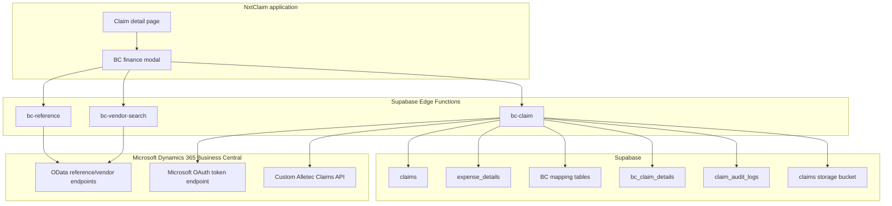
