# NxtClaimV2 Workflow Documentation

Last updated: 2026-05-27

Source document: `docs/project-documentation.md`

This file is a workflow companion to the main project documentation. It does not
replace `docs/project-documentation.md`; it turns the same project context into
end-to-end diagrams, role flows, state machines, and sequence diagrams.

## How To Read This File

Use this document when you need to understand how a user action moves through
the application.

Use `docs/project-documentation.md` when you need the detailed textual
description of each feature.

Use `business-central.md` when you need the deep Business Central integration
contract and workbook analysis.

## Whole Project Workflow

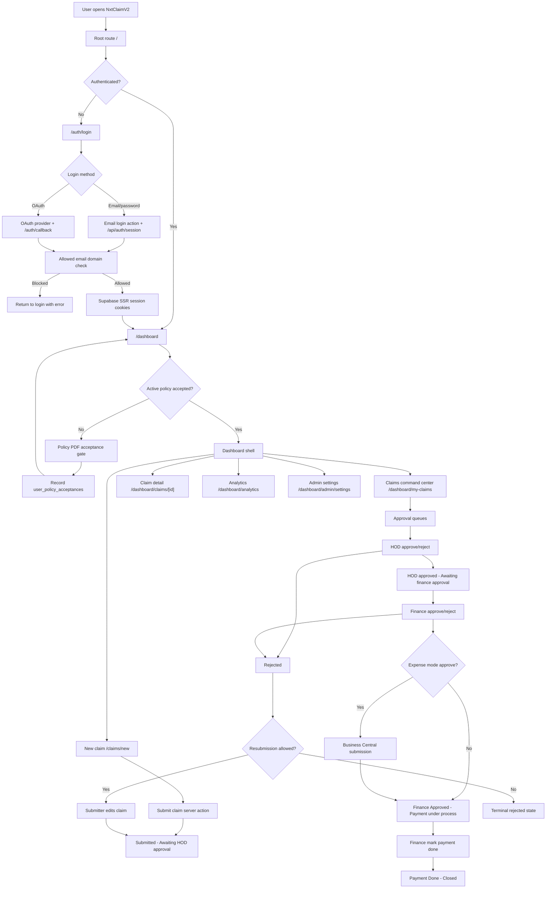
```mermaid
flowchart TD
  Start["User opens NxtClaimV2"] --> Root["Root route /"]
  Root --> AuthCheck{"Authenticated?"}

  AuthCheck -->|"No"| Login["/auth/login"]
  Login --> LoginMethod{"Login method"}
  LoginMethod -->|"Email/password"| EmailLogin["Email login action + /api/auth/session"]
  LoginMethod -->|"OAuth"| OAuth["OAuth provider + /auth/callback"]
  EmailLogin --> DomainCheck["Allowed email domain check"]
  OAuth --> DomainCheck
  DomainCheck -->|"Blocked"| LoginError["Return to login with error"]
  DomainCheck -->|"Allowed"| SessionCookies["Supabase SSR session cookies"]

  AuthCheck -->|"Yes"| DashboardEntry["/dashboard"]
  SessionCookies --> DashboardEntry

  DashboardEntry --> PolicyGate{"Active policy accepted?"}
  PolicyGate -->|"No"| PolicyModal["Policy PDF acceptance gate"]
  PolicyModal --> AcceptPolicy["Record user_policy_acceptances"]
  AcceptPolicy --> DashboardEntry
  PolicyGate -->|"Yes"| Dashboard["Dashboard shell"]

  Dashboard --> NewClaim["New claim /claims/new"]
  Dashboard --> ClaimsCenter["Claims command center /dashboard/my-claims"]
  Dashboard --> ClaimDetail["Claim detail /dashboard/claims/[id]"]
  Dashboard --> Analytics["Analytics /dashboard/analytics"]
  Dashboard --> AdminSettings["Admin settings /dashboard/admin/settings"]

  NewClaim --> SubmitClaim["Submit claim server action"]
  SubmitClaim --> Submitted["Submitted - Awaiting HOD approval"]

  ClaimsCenter --> Approvals["Approval queues"]
  Approvals --> HodDecision["HOD approve/reject"]
  HodDecision --> FinancePending["HOD approved - Awaiting finance approval"]

  FinancePending --> FinanceDecision["Finance approve/reject"]
  FinanceDecision --> BcModal{"Expense mode approve?"}
  BcModal -->|"Yes"| BusinessCentral["Business Central submission"]
  BcModal -->|"No"| FinanceApproved["Finance Approved - Payment under process"]
  BusinessCentral --> FinanceApproved
  FinanceApproved --> MarkPaid["Finance mark payment done"]
  MarkPaid --> Closed["Payment Done - Closed"]

  HodDecision --> Rejected["Rejected"]
  FinanceDecision --> Rejected
  Rejected --> Resubmit{"Resubmission allowed?"}
  Resubmit -->|"Yes"| EditClaim["Submitter edits claim"]
  EditClaim --> Submitted
  Resubmit -->|"No"| TerminalRejected["Terminal rejected state"]
```

## System Architecture Workflow

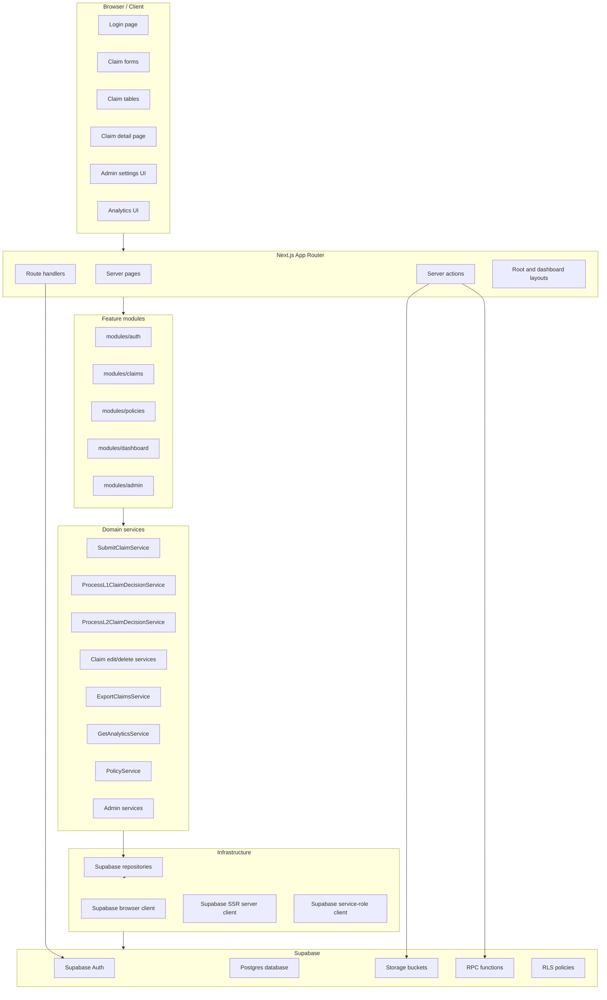
```mermaid
flowchart TB
  subgraph Browser["Browser / Client"]
    LoginPage["Login page"]
    ClaimForms["Claim forms"]
    ClaimTables["Claim tables"]
    DetailPage["Claim detail page"]
    AdminUi["Admin settings UI"]
    AnalyticsUi["Analytics UI"]
  end

  subgraph NextApp["Next.js App Router"]
    Pages["Server pages"]
    RouteHandlers["Route handlers"]
    ServerActions["Server actions"]
    Layouts["Root and dashboard layouts"]
  end

  subgraph Modules["Feature modules"]
    AuthModule["modules/auth"]
    ClaimsModule["modules/claims"]
    PoliciesModule["modules/policies"]
    DashboardModule["modules/dashboard"]
    AdminModule["modules/admin"]
  end

  subgraph Domain["Domain services"]
    SubmitService["SubmitClaimService"]
    L1Service["ProcessL1ClaimDecisionService"]
    L2Service["ProcessL2ClaimDecisionService"]
    EditServices["Claim edit/delete services"]
    ExportService["ExportClaimsService"]
    AnalyticsService["GetAnalyticsService"]
    PolicyService["PolicyService"]
    AdminServices["Admin services"]
  end

  subgraph Infra["Infrastructure"]
    SupabaseBrowser["Supabase browser client"]
    SupabaseServer["Supabase SSR server client"]
    SupabaseAdmin["Supabase service-role client"]
    Repositories["Supabase repositories"]
  end

  subgraph Supabase["Supabase"]
    Auth["Supabase Auth"]
    Database["Postgres database"]
    Storage["Storage buckets"]
    Rpc["RPC functions"]
    Rls["RLS policies"]
  end

  Browser --> NextApp
  NextApp --> Modules
  Modules --> Domain
  Domain --> Repositories
  Repositories --> Infra
  Infra --> Supabase
  RouteHandlers --> Auth
  ServerActions --> Storage
  ServerActions --> Rpc
```

## Route-Level Workflow

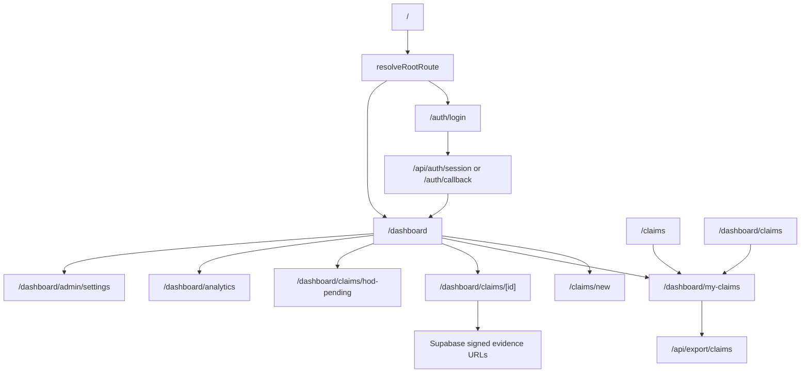
```mermaid
flowchart TD
  Root["/"] --> ResolveRoot["resolveRootRoute"]
  ResolveRoot --> Login["/auth/login"]
  ResolveRoot --> Dashboard["/dashboard"]

  Login --> AuthApi["/api/auth/session or /auth/callback"]
  AuthApi --> Dashboard

  Dashboard --> NewClaim["/claims/new"]
  Dashboard --> MyClaims["/dashboard/my-claims"]
  Dashboard --> ClaimDetail["/dashboard/claims/[id]"]
  Dashboard --> HodPending["/dashboard/claims/hod-pending"]
  Dashboard --> Analytics["/dashboard/analytics"]
  Dashboard --> Admin["/dashboard/admin/settings"]

  LegacyClaims["/claims"] --> MyClaims
  DashboardClaims["/dashboard/claims"] --> MyClaims

  MyClaims --> Export["/api/export/claims"]
  ClaimDetail --> Evidence["Supabase signed evidence URLs"]
```

## Actor And Permission Workflow

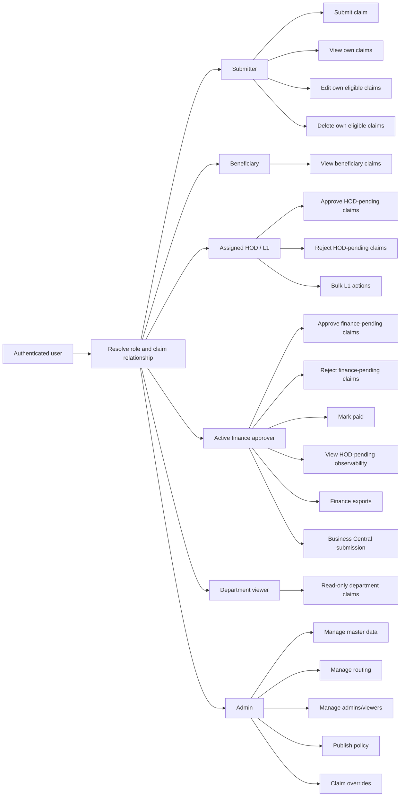
```mermaid
flowchart LR
  User["Authenticated user"] --> RoleResolver["Resolve role and claim relationship"]

  RoleResolver --> Submitter["Submitter"]
  RoleResolver --> Beneficiary["Beneficiary"]
  RoleResolver --> L1["Assigned HOD / L1"]
  RoleResolver --> Finance["Active finance approver"]
  RoleResolver --> DeptViewer["Department viewer"]
  RoleResolver --> Admin["Admin"]

  Submitter --> SubmitClaim["Submit claim"]
  Submitter --> ViewOwn["View own claims"]
  Submitter --> EditOwn["Edit own eligible claims"]
  Submitter --> DeleteOwn["Delete own eligible claims"]

  Beneficiary --> ViewBeneficiary["View beneficiary claims"]

  L1 --> HodApprove["Approve HOD-pending claims"]
  L1 --> HodReject["Reject HOD-pending claims"]
  L1 --> BulkL1["Bulk L1 actions"]

  Finance --> FinanceApprove["Approve finance-pending claims"]
  Finance --> FinanceReject["Reject finance-pending claims"]
  Finance --> MarkPaid["Mark paid"]
  Finance --> HodPendingView["View HOD-pending observability"]
  Finance --> ExportFinance["Finance exports"]
  Finance --> BcSubmit["Business Central submission"]

  DeptViewer --> DeptReadOnly["Read-only department claims"]

  Admin --> MasterData["Manage master data"]
  Admin --> Routing["Manage routing"]
  Admin --> Access["Manage admins/viewers"]
  Admin --> Policy["Publish policy"]
  Admin --> Override["Claim overrides"]
```

## Role Capability Matrix

| Workflow                  | Submitter      | Beneficiary      | HOD / L1              | Finance             | Department viewer    | Admin               |
| ------------------------- | -------------- | ---------------- | --------------------- | ------------------- | -------------------- | ------------------- |
| Sign in                   | Yes            | Yes              | Yes                   | Yes                 | Yes                  | Yes                 |
| Accept policy             | Yes            | Yes              | Yes                   | Yes                 | Yes                  | Yes                 |
| Submit new claim          | Yes            | Yes              | Yes                   | Yes                 | Yes                  | Yes                 |
| Submit on behalf          | Yes            | Yes              | Yes                   | Yes                 | Yes                  | Yes                 |
| View own submissions      | Yes            | When beneficiary | If related            | If finance scope    | If department scope  | Yes                 |
| HOD approve/reject        | No             | No               | Assigned only         | No                  | No                   | Admin override only |
| Finance approve/reject    | No             | No               | No                    | Active finance only | No                   | Admin override only |
| Mark paid                 | No             | No               | No                    | Active finance only | No                   | Admin override only |
| Edit own eligible claim   | Submitter only | No               | Limited pre-HOD paths | Finance-stage only  | No                   | Override paths      |
| Delete own eligible claim | Submitter only | No               | No                    | No                  | No                   | Admin soft delete   |
| Department read-only view | No             | No               | No                    | No                  | Assigned departments | Yes                 |
| Admin settings            | No             | No               | No                    | No                  | No                   | Yes                 |

## Authentication Workflow

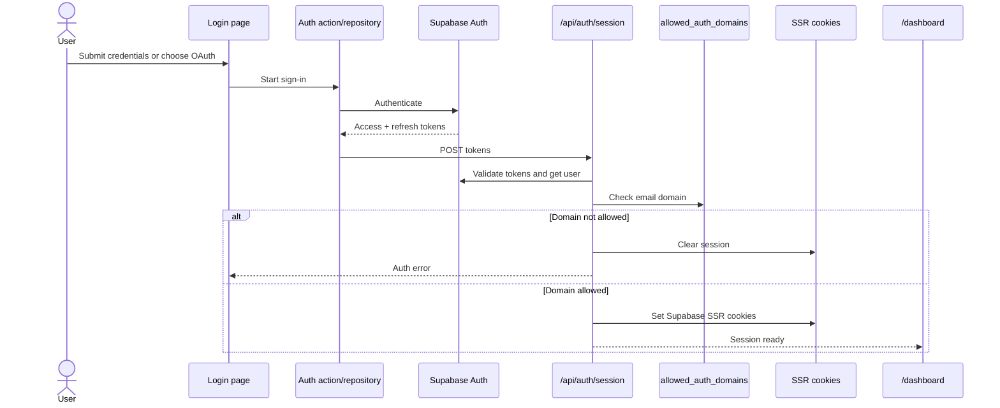
```mermaid
sequenceDiagram
  actor User
  participant Login as Login page
  participant AuthAction as Auth action/repository
  participant SupabaseAuth as Supabase Auth
  participant SessionApi as /api/auth/session
  participant DomainAllowlist as allowed_auth_domains
  participant Cookies as SSR cookies
  participant Dashboard as /dashboard

  User->>Login: Submit credentials or choose OAuth
  Login->>AuthAction: Start sign-in
  AuthAction->>SupabaseAuth: Authenticate
  SupabaseAuth-->>AuthAction: Access + refresh tokens
  AuthAction->>SessionApi: POST tokens
  SessionApi->>SupabaseAuth: Validate tokens and get user
  SessionApi->>DomainAllowlist: Check email domain
  alt Domain not allowed
    SessionApi->>Cookies: Clear session
    SessionApi-->>Login: Auth error
  else Domain allowed
    SessionApi->>Cookies: Set Supabase SSR cookies
    SessionApi-->>Dashboard: Session ready
  end
```

## OAuth Callback Workflow

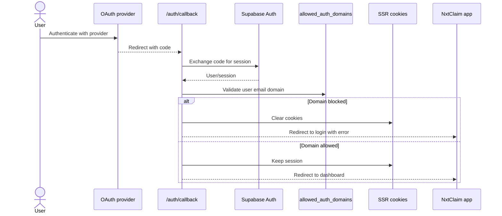
```mermaid
sequenceDiagram
  actor User
  participant Provider as OAuth provider
  participant Callback as /auth/callback
  participant Supabase as Supabase Auth
  participant Domain as allowed_auth_domains
  participant Cookies as SSR cookies
  participant App as NxtClaim app

  User->>Provider: Authenticate with provider
  Provider-->>Callback: Redirect with code
  Callback->>Supabase: Exchange code for session
  Supabase-->>Callback: User/session
  Callback->>Domain: Validate user email domain
  alt Domain blocked
    Callback->>Cookies: Clear cookies
    Callback-->>App: Redirect to login with error
  else Domain allowed
    Callback->>Cookies: Keep session
    Callback-->>App: Redirect to dashboard
  end
```

## Policy Gate Workflow

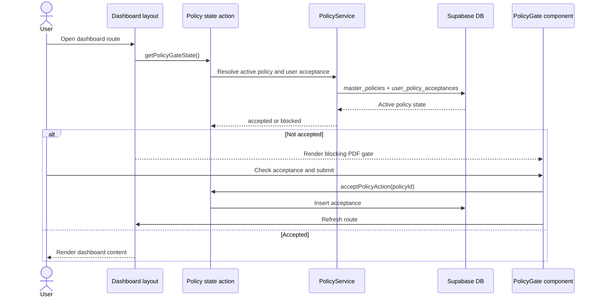
```mermaid
sequenceDiagram
  actor User
  participant DashboardLayout as Dashboard layout
  participant PolicyAction as Policy state action
  participant PolicyService as PolicyService
  participant DB as Supabase DB
  participant Gate as PolicyGate component

  User->>DashboardLayout: Open dashboard route
  DashboardLayout->>PolicyAction: getPolicyGateState()
  PolicyAction->>PolicyService: Resolve active policy and user acceptance
  PolicyService->>DB: master_policies + user_policy_acceptances
  DB-->>PolicyService: Active policy state
  PolicyService-->>PolicyAction: accepted or blocked
  alt Not accepted
    DashboardLayout-->>Gate: Render blocking PDF gate
    User->>Gate: Check acceptance and submit
    Gate->>PolicyAction: acceptPolicyAction(policyId)
    PolicyAction->>DB: Insert acceptance
    Gate->>DashboardLayout: Refresh route
  else Accepted
    DashboardLayout-->>User: Render dashboard content
  end
```

## Claim Submission Workflow

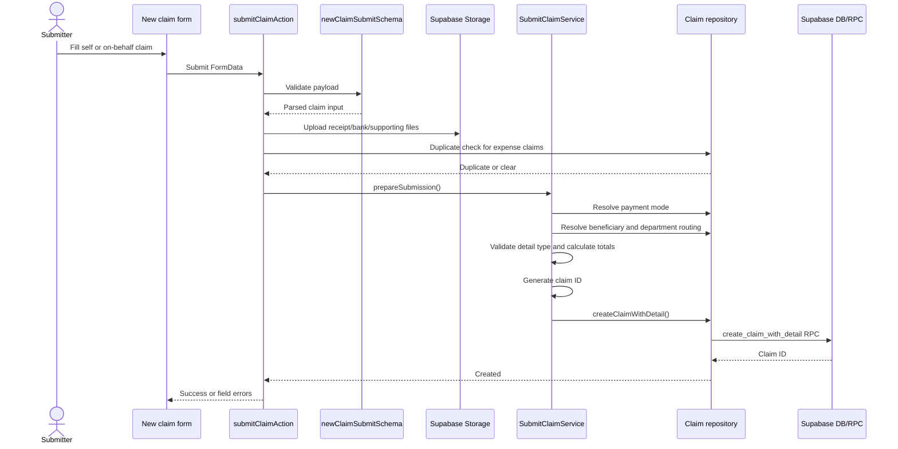
```mermaid
sequenceDiagram
  actor Submitter
  participant Form as New claim form
  participant Action as submitClaimAction
  participant Schema as newClaimSubmitSchema
  participant Storage as Supabase Storage
  participant Service as SubmitClaimService
  participant Repo as Claim repository
  participant DB as Supabase DB/RPC

  Submitter->>Form: Fill self or on-behalf claim
  Form->>Action: Submit FormData
  Action->>Schema: Validate payload
  Schema-->>Action: Parsed claim input
  Action->>Storage: Upload receipt/bank/supporting files
  Action->>Repo: Duplicate check for expense claims
  Repo-->>Action: Duplicate or clear
  Action->>Service: prepareSubmission()
  Service->>Repo: Resolve payment mode
  Service->>Repo: Resolve beneficiary and department routing
  Service->>Service: Validate detail type and calculate totals
  Service->>Service: Generate claim ID
  Service->>Repo: createClaimWithDetail()
  Repo->>DB: create_claim_with_detail RPC
  DB-->>Repo: Claim ID
  Repo-->>Action: Created
  Action-->>Form: Success or field errors
```

## Submission Routing Decision

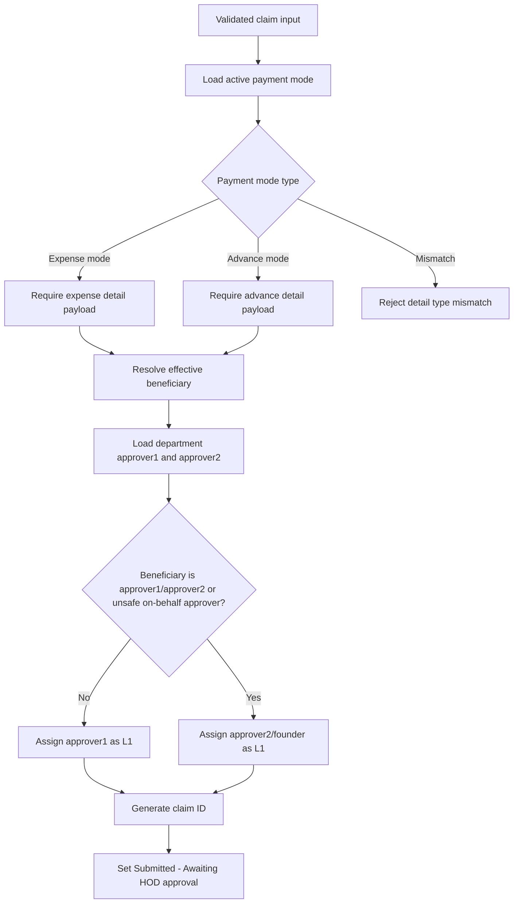
```mermaid
flowchart TD
  Input["Validated claim input"] --> PaymentMode["Load active payment mode"]
  PaymentMode --> ModeType{"Payment mode type"}

  ModeType -->|"Expense mode"| Expense["Require expense detail payload"]
  ModeType -->|"Advance mode"| Advance["Require advance detail payload"]
  ModeType -->|"Mismatch"| Mismatch["Reject detail type mismatch"]

  Expense --> Beneficiary["Resolve effective beneficiary"]
  Advance --> Beneficiary

  Beneficiary --> Routing["Load department approver1 and approver2"]
  Routing --> SelfApprovalRisk{"Beneficiary is approver1/approver2 or unsafe on-behalf approver?"}

  SelfApprovalRisk -->|"No"| AssignHod["Assign approver1 as L1"]
  SelfApprovalRisk -->|"Yes"| AssignFounder["Assign approver2/founder as L1"]

  AssignHod --> ClaimId["Generate claim ID"]
  AssignFounder --> ClaimId
  ClaimId --> InitialStatus["Set Submitted - Awaiting HOD approval"]
```

## Claim Detail Type Workflow

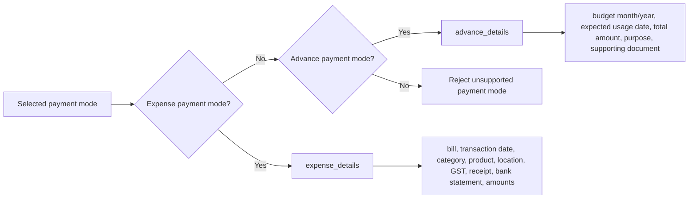
```mermaid
flowchart LR
  PaymentMode["Selected payment mode"] --> IsExpense{"Expense payment mode?"}
  IsExpense -->|"Yes"| ExpenseDetail["expense_details"]
  IsExpense -->|"No"| IsAdvance{"Advance payment mode?"}
  IsAdvance -->|"Yes"| AdvanceDetail["advance_details"]
  IsAdvance -->|"No"| Invalid["Reject unsupported payment mode"]

  ExpenseDetail --> ExpenseFields["bill, transaction date, category, product, location, GST, receipt, bank statement, amounts"]
  AdvanceDetail --> AdvanceFields["budget month/year, expected usage date, total amount, purpose, supporting document"]
```

## AI Receipt Parsing Workflow

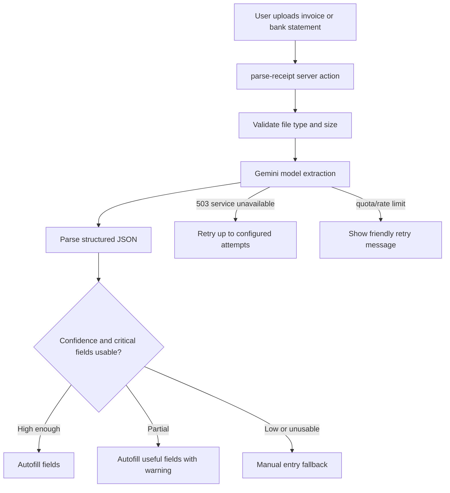
```mermaid
flowchart TD
  Upload["User uploads invoice or bank statement"] --> Parser["parse-receipt server action"]
  Parser --> Validate["Validate file type and size"]
  Validate --> Gemini["Gemini model extraction"]
  Gemini --> ParseJson["Parse structured JSON"]
  ParseJson --> Confidence{"Confidence and critical fields usable?"}

  Confidence -->|"High enough"| Autofill["Autofill fields"]
  Confidence -->|"Partial"| Partial["Autofill useful fields with warning"]
  Confidence -->|"Low or unusable"| Manual["Manual entry fallback"]

  Gemini -->|"503 service unavailable"| Retry["Retry up to configured attempts"]
  Gemini -->|"quota/rate limit"| FriendlyError["Show friendly retry message"]
```

## File Upload And Cleanup Workflow

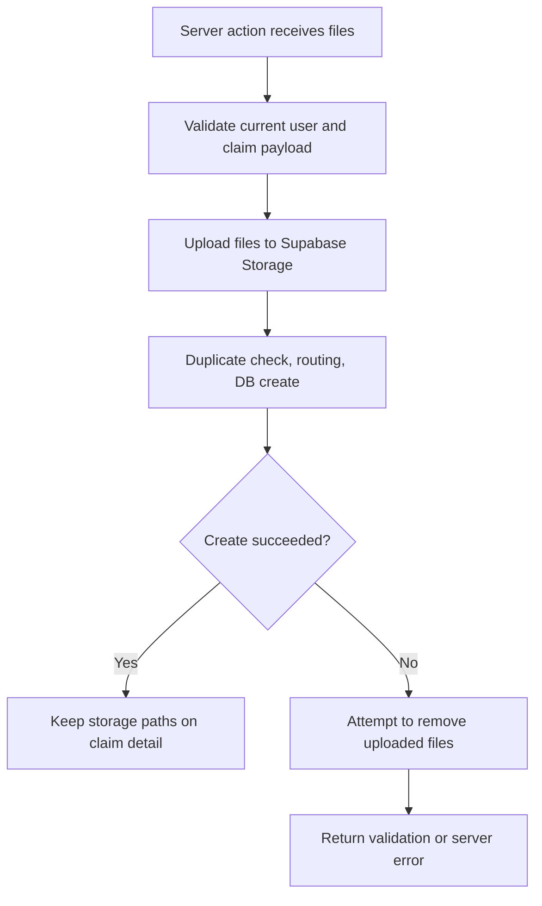
```mermaid
flowchart TD
  Start["Server action receives files"] --> Validate["Validate current user and claim payload"]
  Validate --> Upload["Upload files to Supabase Storage"]
  Upload --> LaterSteps["Duplicate check, routing, DB create"]
  LaterSteps --> Success{"Create succeeded?"}
  Success -->|"Yes"| Persist["Keep storage paths on claim detail"]
  Success -->|"No"| Cleanup["Attempt to remove uploaded files"]
  Cleanup --> Error["Return validation or server error"]
```

## Claim Lifecycle State Machine

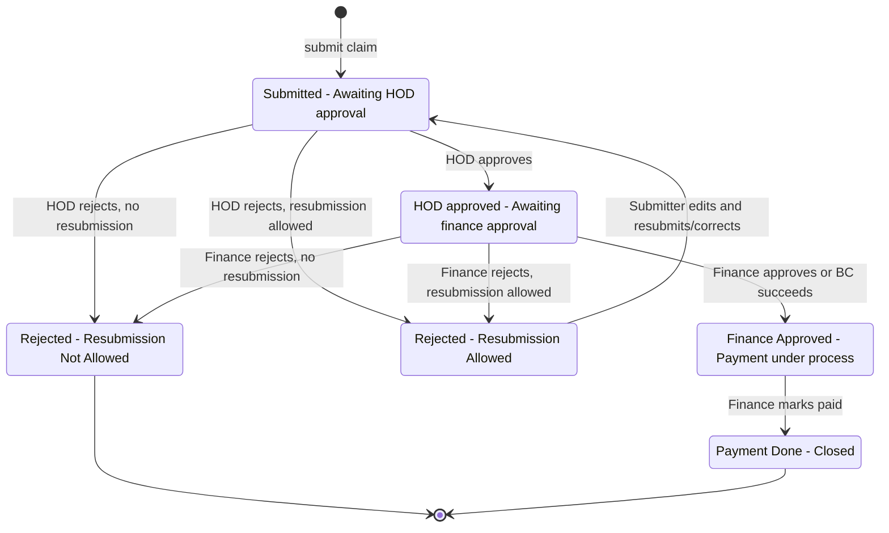
```mermaid
stateDiagram-v2
  [*] --> Submitted: submit claim
  Submitted: Submitted - Awaiting HOD approval
  HodApproved: HOD approved - Awaiting finance approval
  FinanceApproved: Finance Approved - Payment under process
  Paid: Payment Done - Closed
  RejectedAllowed: Rejected - Resubmission Allowed
  RejectedTerminal: Rejected - Resubmission Not Allowed

  Submitted --> HodApproved: HOD approves
  Submitted --> RejectedAllowed: HOD rejects, resubmission allowed
  Submitted --> RejectedTerminal: HOD rejects, no resubmission

  HodApproved --> FinanceApproved: Finance approves or BC succeeds
  HodApproved --> RejectedAllowed: Finance rejects, resubmission allowed
  HodApproved --> RejectedTerminal: Finance rejects, no resubmission

  FinanceApproved --> Paid: Finance marks paid

  RejectedAllowed --> Submitted: Submitter edits and resubmits/corrects
  RejectedTerminal --> [*]
  Paid --> [*]
```

## HOD Approval Workflow

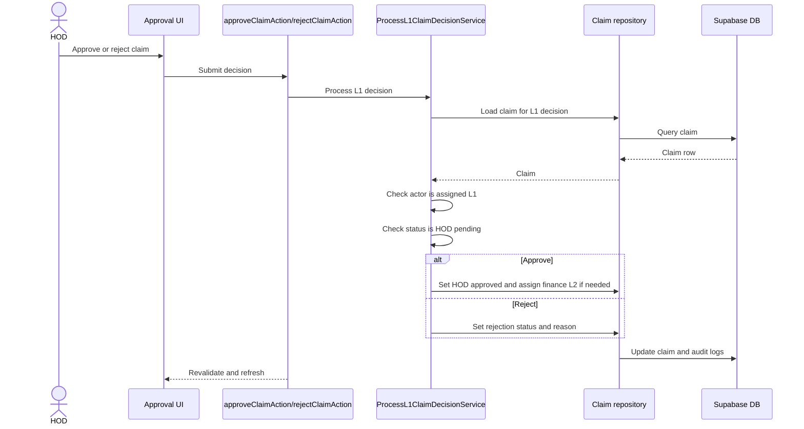
```mermaid
sequenceDiagram
  actor HOD
  participant UI as Approval UI
  participant Action as approveClaimAction/rejectClaimAction
  participant Service as ProcessL1ClaimDecisionService
  participant Repo as Claim repository
  participant DB as Supabase DB

  HOD->>UI: Approve or reject claim
  UI->>Action: Submit decision
  Action->>Service: Process L1 decision
  Service->>Repo: Load claim for L1 decision
  Repo->>DB: Query claim
  DB-->>Repo: Claim row
  Repo-->>Service: Claim
  Service->>Service: Check actor is assigned L1
  Service->>Service: Check status is HOD pending
  alt Approve
    Service->>Repo: Set HOD approved and assign finance L2 if needed
  else Reject
    Service->>Repo: Set rejection status and reason
  end
  Repo->>DB: Update claim and audit logs
  Action-->>UI: Revalidate and refresh
```

## Finance Approval And Business Central Workflow

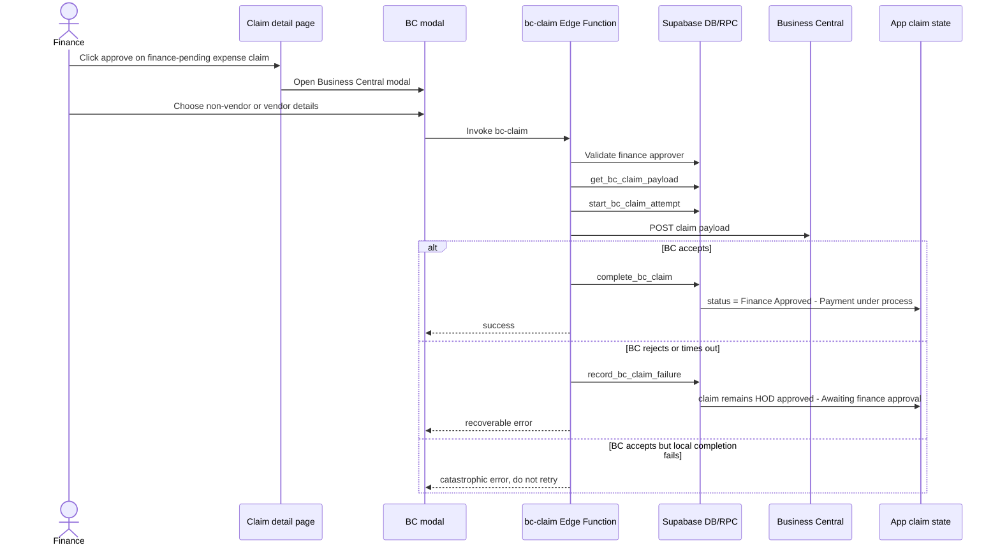
```mermaid
sequenceDiagram
  actor Finance
  participant Detail as Claim detail page
  participant Modal as BC modal
  participant BcFn as bc-claim Edge Function
  participant DB as Supabase DB/RPC
  participant BC as Business Central
  participant App as App claim state

  Finance->>Detail: Click approve on finance-pending expense claim
  Detail->>Modal: Open Business Central modal
  Finance->>Modal: Choose non-vendor or vendor details
  Modal->>BcFn: Invoke bc-claim
  BcFn->>DB: Validate finance approver
  BcFn->>DB: get_bc_claim_payload
  BcFn->>DB: start_bc_claim_attempt
  BcFn->>BC: POST claim payload
  alt BC accepts
    BcFn->>DB: complete_bc_claim
    DB->>App: status = Finance Approved - Payment under process
    BcFn-->>Modal: success
  else BC rejects or times out
    BcFn->>DB: record_bc_claim_failure
    DB->>App: claim remains HOD approved - Awaiting finance approval
    BcFn-->>Modal: recoverable error
  else BC accepts but local completion fails
    BcFn-->>Modal: catastrophic error, do not retry
  end
```

## Direct Finance Approval Workflow

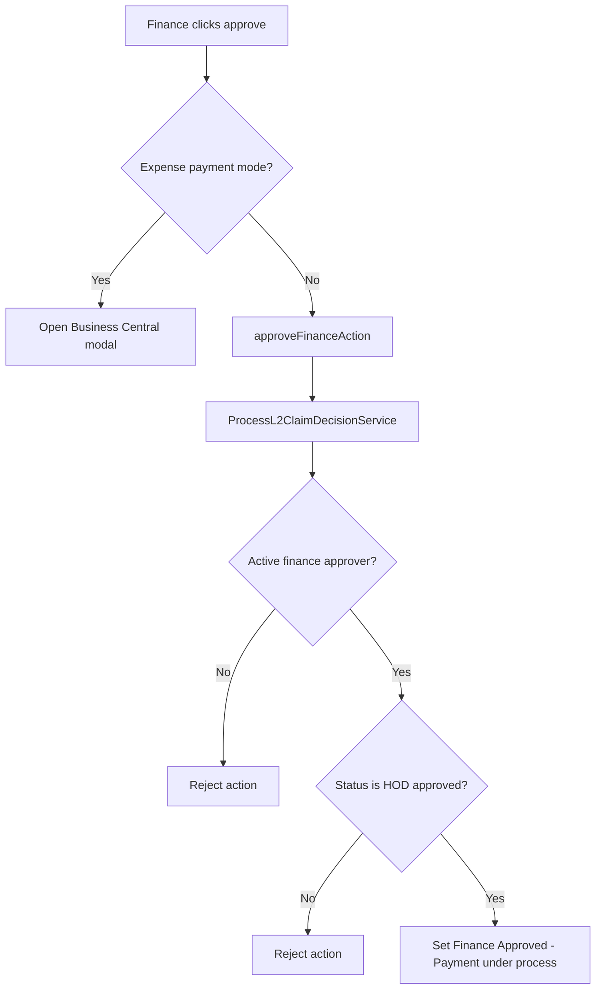
```mermaid
flowchart TD
  Start["Finance clicks approve"] --> ExpenseCheck{"Expense payment mode?"}
  ExpenseCheck -->|"Yes"| BcModal["Open Business Central modal"]
  ExpenseCheck -->|"No"| DirectAction["approveFinanceAction"]
  DirectAction --> L2Service["ProcessL2ClaimDecisionService"]
  L2Service --> ActorCheck{"Active finance approver?"}
  ActorCheck -->|"No"| Forbidden["Reject action"]
  ActorCheck -->|"Yes"| StatusCheck{"Status is HOD approved?"}
  StatusCheck -->|"No"| Invalid["Reject action"]
  StatusCheck -->|"Yes"| FinanceApproved["Set Finance Approved - Payment under process"]
```

## Mark Payment Done Workflow

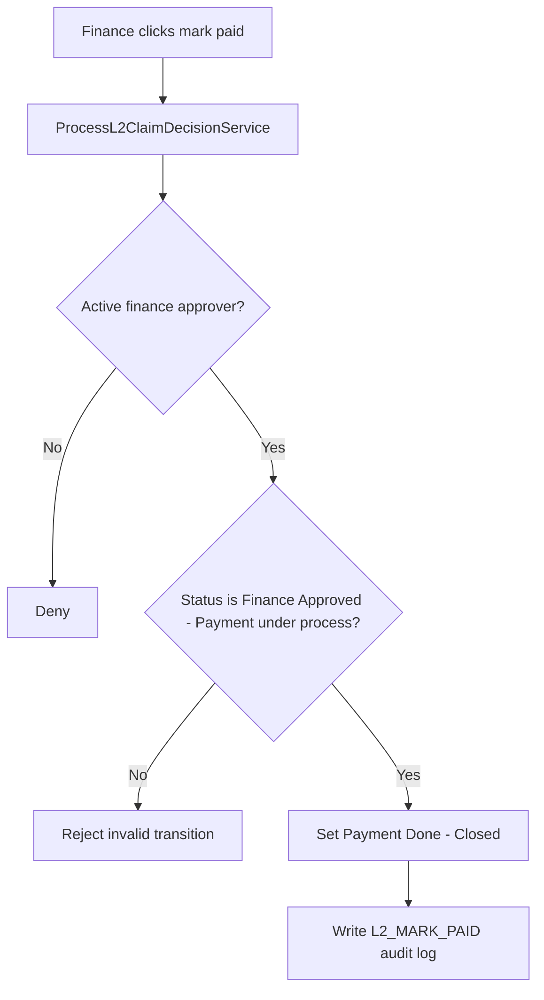
```mermaid
flowchart TD
  Start["Finance clicks mark paid"] --> Service["ProcessL2ClaimDecisionService"]
  Service --> FinanceCheck{"Active finance approver?"}
  FinanceCheck -->|"No"| Deny["Deny"]
  FinanceCheck -->|"Yes"| StatusCheck{"Status is Finance Approved - Payment under process?"}
  StatusCheck -->|"No"| Invalid["Reject invalid transition"]
  StatusCheck -->|"Yes"| Paid["Set Payment Done - Closed"]
  Paid --> Audit["Write L2_MARK_PAID audit log"]
```

## Rejection And Resubmission Workflow

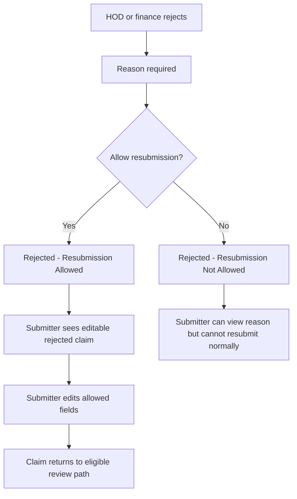
```mermaid
flowchart TD
  Reject["HOD or finance rejects"] --> Reason["Reason required"]
  Reason --> Allow{"Allow resubmission?"}
  Allow -->|"Yes"| RejectedAllowed["Rejected - Resubmission Allowed"]
  Allow -->|"No"| RejectedNo["Rejected - Resubmission Not Allowed"]

  RejectedAllowed --> SubmitterView["Submitter sees editable rejected claim"]
  SubmitterView --> Edit["Submitter edits allowed fields"]
  Edit --> Reenter["Claim returns to eligible review path"]

  RejectedNo --> Terminal["Submitter can view reason but cannot resubmit normally"]
```

## Edit Workflow

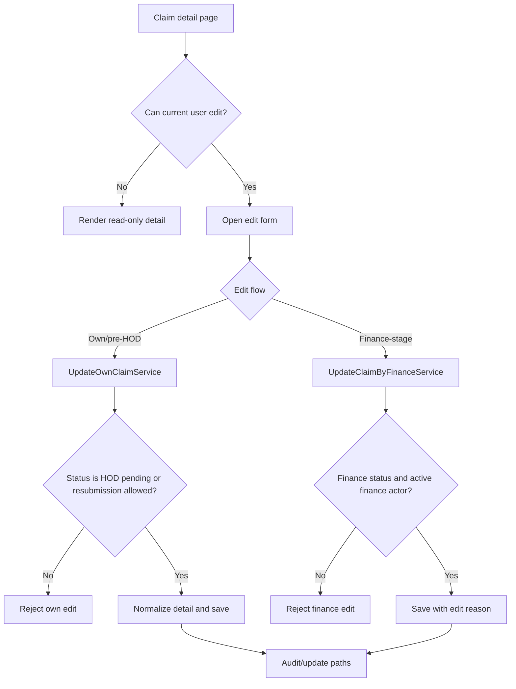
```mermaid
flowchart TD
  ClaimDetail["Claim detail page"] --> CanEdit{"Can current user edit?"}
  CanEdit -->|"No"| ReadOnly["Render read-only detail"]
  CanEdit -->|"Yes"| EditForm["Open edit form"]

  EditForm --> EditType{"Edit flow"}
  EditType -->|"Own/pre-HOD"| OwnEdit["UpdateOwnClaimService"]
  EditType -->|"Finance-stage"| FinanceEdit["UpdateClaimByFinanceService"]

  OwnEdit --> OwnStatus{"Status is HOD pending or resubmission allowed?"}
  OwnStatus -->|"No"| DenyOwn["Reject own edit"]
  OwnStatus -->|"Yes"| SaveOwn["Normalize detail and save"]

  FinanceEdit --> FinanceStatus{"Finance status and active finance actor?"}
  FinanceStatus -->|"No"| DenyFinance["Reject finance edit"]
  FinanceStatus -->|"Yes"| SaveFinance["Save with edit reason"]

  SaveOwn --> Audit["Audit/update paths"]
  SaveFinance --> Audit
```

## Delete Workflow

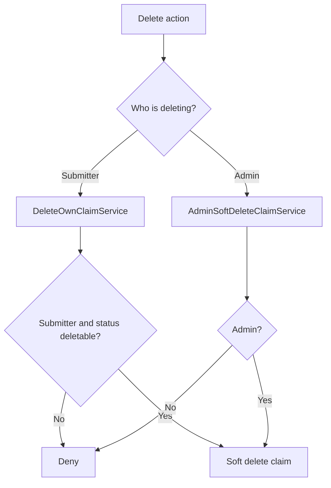
```mermaid
flowchart TD
  Start["Delete action"] --> Actor{"Who is deleting?"}
  Actor -->|"Submitter"| OwnDelete["DeleteOwnClaimService"]
  Actor -->|"Admin"| AdminDelete["AdminSoftDeleteClaimService"]

  OwnDelete --> OwnCheck{"Submitter and status deletable?"}
  OwnCheck -->|"No"| Deny["Deny"]
  OwnCheck -->|"Yes"| SoftDelete["Soft delete claim"]

  AdminDelete --> AdminCheck{"Admin?"}
  AdminCheck -->|"No"| Deny
  AdminCheck -->|"Yes"| SoftDelete
```

Submitter-deletable statuses:

```text
Submitted - Awaiting HOD approval
Rejected - Resubmission Allowed
```

## Claim List And Detail Permission Workflow

```mermaid
flowchart TD
  User["Current user"] --> Context["Resolve viewer context"]
  Context --> IsSubmitter{"Submitter?"}
  Context --> IsBeneficiary{"Beneficiary?"}
  Context --> IsL1{"Assigned L1?"}
  Context --> IsFinance{"Active finance?"}
  Context --> IsDeptViewer{"Department viewer for claim department?"}
  Context --> IsAdmin{"Admin?"}

  IsSubmitter --> AllowView["Allow view"]
  IsBeneficiary --> AllowView
  IsL1 --> AllowView
  IsFinance --> AllowView
  IsDeptViewer --> AllowView
  IsAdmin --> AllowView

  AllowView --> Actions["Resolve available actions"]
  Actions --> ReadOnly["Read-only where no mutation permission"]
  Actions --> L1Actions["L1 approve/reject if assigned and HOD pending"]
  Actions --> FinanceActions["Finance approve/reject/mark-paid if eligible"]
  Actions --> OwnActions["Own edit/delete if eligible"]
  Actions --> AdminActions["Admin panels if admin"]
```

## Claims Command Center Workflow

```mermaid
flowchart TD
  Page["/dashboard/my-claims"] --> Auth["Resolve current user"]
  Auth --> Context["Resolve admin, finance, approver, department viewer contexts"]
  Context --> DefaultTab["Choose default view mode"]

  DefaultTab --> Submissions["Submissions view"]
  DefaultTab --> Approvals["Approvals view"]
  DefaultTab --> AdminActive["Admin active claims"]
  DefaultTab --> AdminDeleted["Admin deleted claims"]
  DefaultTab --> Department["Department viewer claims"]

  Submissions --> Filters["Apply filters and cursor pagination"]
  Approvals --> Filters
  AdminActive --> Filters
  AdminDeleted --> Filters
  Department --> Filters

  Filters --> Table["Render claims table"]
  Table --> Detail["Open claim detail"]
  Table --> Export["Export selected scope"]
```

## Bulk Action Workflow

```mermaid
flowchart TD
  Select["User selects claims or global selection"] --> Scope{"Actor scope"}
  Scope -->|"HOD"| L1Bulk["bulkApproveL1 / bulkRejectL1"]
  Scope -->|"Finance"| L2Bulk["bulkApprove / bulkReject / bulkMarkPaid"]

  L1Bulk --> L1Resolve["Resolve eligible L1 claim IDs"]
  L1Resolve --> L1Chunks["Process in chunks"]
  L1Chunks --> L1PerClaim["Validate each claim actor/status"]
  L1PerClaim --> L1Result["Return processed count/results"]

  L2Bulk --> L2Service["BulkProcessClaimsService"]
  L2Service --> Rpc["bulk_process_claims RPC"]
  Rpc --> L2Result["Return processed count/results"]
```

## Export Workflow

```mermaid
sequenceDiagram
  actor User
  participant UI as Claims list
  participant Api as /api/export/claims
  participant Service as ExportClaimsService
  participant Repo as Claim repository
  participant Storage as Supabase Storage
  participant File as Export file

  User->>UI: Request export with filters
  UI->>Api: GET/POST export request
  Api->>Service: Execute export
  Service->>Service: Validate date range and scope
  Service->>Repo: Resolve viewer context
  Service->>Repo: Fetch rows in batches
  Repo-->>Service: Export rows
  Service->>Storage: Generate signed evidence URLs
  Storage-->>Service: URLs or recoverable warnings
  Service-->>Api: Export rows
  Api-->>File: Build workbook/CSV response
  File-->>User: Download
```

Export scopes:

```mermaid
flowchart LR
  Scope["Requested export scope"] --> Submissions["submissions: own submitted claims"]
  Scope --> Approvals["approvals: finance or L1 approvals"]
  Scope --> HodPending["finance_hod_pending: finance only"]
  Scope --> Admin["admin: admin only"]
  Scope --> Department["department: assigned department viewer only"]
```

## Dashboard And Wallet Workflow

```mermaid
flowchart TD
  Dashboard["/dashboard"] --> Auth["Require authenticated user"]
  Auth --> Policy["Policy gate"]
  Policy --> Roles["Resolve role context"]
  Roles --> Wallet["GetWalletSummaryService"]
  Wallet --> Validate["Validate wallet metrics"]
  Validate --> Cards["Render wallet/dashboard cards"]
  Roles --> Nav["Build allowed navigation"]

  Nav --> NewClaim["New Claim"]
  Nav --> Claims["Claims"]
  Nav --> HodPending["HOD Pending if finance"]
  Nav --> Analytics["Analytics if scope exists"]
  Nav --> Settings["System Settings if admin"]
```

## Analytics Workflow

```mermaid
sequenceDiagram
  actor User
  participant Page as /dashboard/analytics
  participant Service as GetAnalyticsService
  participant Repo as Analytics repository
  participant RPC as get_dashboard_analytics_payload
  participant DB as Analytics tables/views

  User->>Page: Open analytics with filters
  Page->>Service: Resolve analytics payload
  Service->>Service: Resolve scope: admin, finance, or HOD
  Service->>Service: Validate dates and authorized filters
  Service->>Repo: Query analytics
  Repo->>RPC: get_dashboard_analytics_payload
  RPC->>DB: Read analytics cache/snapshots
  DB-->>RPC: Aggregates
  RPC-->>Repo: JSON payload
  Repo-->>Service: Analytics result
  Service-->>Page: KPI and chart data
```

Analytics scope:

```mermaid
flowchart TD
  User["Current user"] --> AdminCheck{"Admin?"}
  AdminCheck -->|"Yes"| AdminScope["Admin analytics scope"]
  AdminCheck -->|"No"| FinanceCheck{"Active finance approver?"}
  FinanceCheck -->|"Yes"| FinanceScope["Finance analytics scope"]
  FinanceCheck -->|"No"| HodCheck{"HOD department scope?"}
  HodCheck -->|"Yes"| HodScope["HOD analytics scope"]
  HodCheck -->|"No"| NoAnalytics["No analytics access"]
```

## Admin Settings Workflow

```mermaid
flowchart TD
  AdminRoute["/dashboard/admin/settings"] --> AdminCheck{"Current user is admin?"}
  AdminCheck -->|"No"| NotFound["notFound"]
  AdminCheck -->|"Yes"| Settings["Render settings groups"]

  Settings --> MasterData["Master Data"]
  Settings --> Routing["Routing"]
  Settings --> Access["Access"]
  Settings --> Governance["Governance"]

  MasterData --> Categories["Expense categories"]
  MasterData --> Products["Products"]
  MasterData --> Locations["Locations"]
  MasterData --> PaymentModes["Payment modes"]

  Routing --> Departments["Departments and actors"]
  Routing --> FinanceApprovers["Finance approvers"]
  Routing --> DeptViewers["Department viewers"]

  Access --> Admins["Administrators"]

  Governance --> Policy["Company policy"]
  Governance --> Overrides["Claim overrides"]
```

## Admin Mutation Workflow

```mermaid
sequenceDiagram
  actor Admin
  participant UI as Admin settings UI
  participant Action as Admin server action
  participant Guard as requireAdmin
  participant Schema as Zod schema
  participant Service as Admin domain service
  participant Repo as Admin repository
  participant DB as Supabase DB

  Admin->>UI: Submit admin change
  UI->>Action: FormData/request
  Action->>Guard: Verify admin
  Guard-->>Action: Admin user
  Action->>Schema: Validate input
  Schema-->>Action: Parsed input
  Action->>Service: Execute business operation
  Service->>Repo: Persist change
  Repo->>DB: Insert/update/deactivate
  DB-->>Repo: Result
  Repo-->>Service: Result
  Service-->>Action: Domain result
  Action-->>UI: Revalidate settings and role caches
```

## Department Viewer Workflow

```mermaid
flowchart TD
  AdminAssign["Admin assigns department viewer"] --> ViewerLogin["Viewer signs in"]
  ViewerLogin --> ClaimsPage["Viewer opens claims command center"]
  ClaimsPage --> Resolve["Resolve viewer department IDs"]
  Resolve --> HasDepartments{"Any assigned departments?"}
  HasDepartments -->|"No"| Empty["Return empty department view"]
  HasDepartments -->|"Yes"| Query["Query claims for assigned departments"]
  Query --> Table["Render department tab"]
  Table --> Detail["Open claim detail"]
  Detail --> ReadOnly["Read-only detail, no actions"]
```

## Business Central Workflow Overview

Detailed BC documentation is in `business-central.md`.

```mermaid
flowchart TD
  FinancePending["HOD approved - Awaiting finance approval"] --> FinanceApprove["Finance approve"]
  FinanceApprove --> ExpenseMode{"Expense payment mode?"}
  ExpenseMode -->|"No"| Direct["Direct finance approval"]
  ExpenseMode -->|"Yes"| Modal["BC modal"]
  Modal --> PaymentType{"Vendor payment?"}
  PaymentType -->|"No"| NonVendor["Build non-vendor payload"]
  PaymentType -->|"Yes"| Vendor["Search vendor and reference codes"]
  Vendor --> BuildPayload["Build BC payload"]
  NonVendor --> BuildPayload
  BuildPayload --> Attempt["Insert bc_claim_details submitting"]
  Attempt --> Post["POST to Business Central"]
  Post --> Success{"BC accepted?"}
  Success -->|"Yes"| Complete["complete_bc_claim"]
  Complete --> FinanceApproved["Finance Approved - Payment under process"]
  Success -->|"No"| Failure["record_bc_claim_failure, retry later"]
  Failure --> FinancePending
```

## Database And Storage Workflow

```mermaid
flowchart TB
  subgraph Data["Postgres tables"]
    Users["users"]
    Claims["claims"]
    Expense["expense_details"]
    Advance["advance_details"]
    Audit["claim_audit_logs"]
    Wallets["wallets"]
    Policies["master_policies"]
    Acceptances["user_policy_acceptances"]
    Admins["admins"]
    Finance["master_finance_approvers"]
    Departments["master_departments"]
    Viewers["department_viewers"]
    Mapping["BC/master mapping tables"]
  end

  subgraph Storage["Supabase Storage"]
    ClaimFiles["claims bucket: receipts, bank statements, supporting docs"]
    PolicyFiles["policies bucket: policy PDFs"]
  end

  Users --> Claims
  Claims --> Expense
  Claims --> Advance
  Claims --> Audit
  Claims --> Wallets
  Policies --> Acceptances
  Departments --> Claims
  Departments --> Viewers
  Finance --> Claims
  Mapping --> Claims
  ClaimFiles --> Expense
  ClaimFiles --> Advance
  PolicyFiles --> Policies
```

## Migration And Seed Workflow

```mermaid
flowchart TD
  Dev["Developer"] --> Env["Configure SUPABASE_DB_URL and env vars"]
  Env --> DryRun["npm run migrate:dry-run"]
  DryRun --> Review{"Dry run acceptable?"}
  Review -->|"No"| FixSql["Fix migration SQL"]
  FixSql --> DryRun
  Review -->|"Yes"| Apply["npm run migrate"]
  Apply --> History["_migration_history updated"]
  History --> Seed{"Need seed data?"}
  Seed -->|"Master routing"| MasterSeed["npm run seed:master-routing:apply"]
  Seed -->|"Historical analytics"| AnalyticsSeed["npm run seed:historical-analytics:apply"]
  Seed -->|"No"| Done["Environment ready"]
  MasterSeed --> Done
  AnalyticsSeed --> Done
```

## End-To-End Scenario: Self Claim To Paid

```mermaid
flowchart TD
  A["Employee logs in"] --> B["Accepts active policy"]
  B --> C["Creates self expense claim"]
  C --> D["Uploads receipt and required evidence"]
  D --> E["Server validates schema, duplicates, routing"]
  E --> F["Claim submitted to HOD"]
  F --> G["Assigned HOD approves"]
  G --> H["Claim enters finance queue"]
  H --> I["Finance reviews evidence"]
  I --> J["Finance submits to BC or direct-approves"]
  J --> K["Claim becomes payment under process"]
  K --> L["Finance marks payment done"]
  L --> M["Claim closed"]
```

## End-To-End Scenario: On-Behalf Claim

```mermaid
flowchart TD
  A["Submitter logs in"] --> B["Selects On Behalf"]
  B --> C["Enters beneficiary email and employee code"]
  C --> D["Server validates on-behalf fields"]
  D --> E["Server resolves or provisions beneficiary"]
  E --> F["Claim ID uses beneficiary employee code"]
  F --> G["Routing uses selected department and bypass rules"]
  G --> H["Claim follows HOD and finance lifecycle"]
  H --> I["Submitter and beneficiary can view according to permissions"]
```

## End-To-End Scenario: Rejection With Resubmission

```mermaid
flowchart TD
  A["Claim submitted"] --> B["Approver rejects with reason"]
  B --> C{"Resubmission allowed?"}
  C -->|"Yes"| D["Status: Rejected - Resubmission Allowed"]
  D --> E["Submitter edits claim"]
  E --> F["Claim returns to eligible review path"]
  C -->|"No"| G["Status: Rejected - Resubmission Not Allowed"]
  G --> H["Submitter can view but not resubmit normally"]
```

## End-To-End Scenario: Admin Adds Finance Approver

```mermaid
flowchart TD
  A["Admin opens settings"] --> B["Routing: Finance Approvers"]
  B --> C["Enter finance approver email or user ID"]
  C --> D["Server verifies admin"]
  D --> E["Service resolves user"]
  E --> F["Repository writes master_finance_approvers"]
  F --> G["Role caches revalidated"]
  G --> H["User can take finance actions if active"]
```

## Where To Change Code By Workflow

| Workflow                 | Primary files                                                                                                  |
| ------------------------ | -------------------------------------------------------------------------------------------------------------- |
| Auth/login/session       | `src/modules/auth`, `src/app/api/auth`, `src/app/auth/callback`                                                |
| Policy gate              | `src/modules/policies`, `src/core/domain/policies`, `src/app/(dashboard)/layout.tsx`                           |
| Claim submission         | `src/app/claims/new`, `src/modules/claims/actions.ts`, `src/core/domain/claims/services/SubmitClaimService.ts` |
| Claim validation         | `src/modules/claims/validators/*`                                                                              |
| HOD decisions            | `ProcessL1ClaimDecisionService`, claim actions                                                                 |
| Finance decisions        | `ProcessL2ClaimDecisionService`, claim actions, BC modal for expense modes                                     |
| Claim detail permissions | Claim detail page, `get-available-claim-actions.ts`                                                            |
| Claim list views         | `/dashboard/my-claims`, claim repositories                                                                     |
| Export                   | `ExportClaimsService`, `/api/export/claims`                                                                    |
| Dashboard/wallet         | `src/core/domain/dashboard`, `src/modules/dashboard`                                                           |
| Analytics                | `GetAnalyticsService`, analytics repository, analytics RPC                                                     |
| Admin settings           | `src/modules/admin`, `src/core/domain/admin`                                                                   |
| Department viewer        | `GetDepartmentViewClaimsService`, department viewer repository                                                 |
| Business Central         | `business-central.md`, `supabase/functions/bc-*`, BC migrations                                                |

## Verification Map

```mermaid
flowchart LR
  Change["Workflow change"] --> Unit["Unit/service tests"]
  Change --> Integration["Integration tests for server action/repository if persistence changes"]
  Change --> E2E["E2E tests for user-visible flows"]
  Change --> Typecheck["npm run typecheck"]
  Change --> Lint["npm run lint"]
  Change --> Build["npm run build"]

  DocsOnly["Documentation-only change"] --> Prettier["prettier --check target file"]
```
